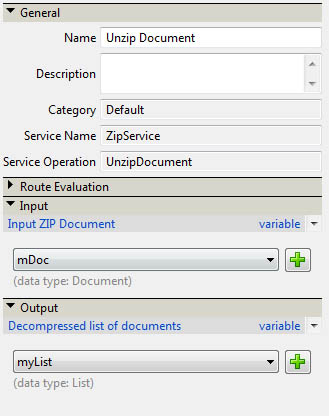

# JEE 사용자 지정 DSC에서 AEM Forms을 사용하여 파일 압축 및 압축 해제 {#compressing-decompressing-files}

## 전제 조건 지식 {#prerequisites}

JEE 프로세스 관리, 기본 Java™ 프로그래밍 및 사용자 지정 구성 요소 만들기에서 AEM Forms을 사용해 보십시오.

**추가 필수 기타 제품**

[Eclipse](https://www.eclipse.org/) 또는 [Netbeans IDE](https://netbeans.apache.org/)와 같은 Java™ 편집기

## 사용자 수준 {#user-level}

중간

AEM Forms on JEE를 사용하면 개발자가 사용자 지정 ASC(Acrobat 서비스 컨테이너)를 만들어 기본 제공 기능을 보강할 수 있습니다. 이러한 구성 요소 만들기는 JEE의 AEM Forms 런타임 환경에 플러그인할 수 있으며 의도된 목적을 수행합니다. 이 문서에서는 파일 목록을 .zip 파일로 압축하고 .zip 을 문서 목록으로 압축 해제하는 데 사용할 수 있는 사용자 지정 ZIP 서비스를 만드는 방법을 설명합니다.

## 사용자 지정 ASC 구성 요소 만들기 {#create-custom-dsc-component}

문서 목록을 압축 및 압축 해제할 수 있도록 두 가지 서비스 작업으로 사용자 지정 ASC 구성 요소를 만듭니다. 이 구성 요소는 압축 및 압축 해제에 java.util.zip 패키지를 사용합니다.

사용자 지정 ASC 구성 요소를 만들려면 다음을 수행하십시오.

1. adobe-livecycle-client.jar 파일을 라이브러리에 추가합니다.
1. 필요한 아이콘 추가
1. 공용 클래스 만들기
1. UnzipDocument 및 ZipDocuments라는 두 가지 공용 메서드 만들기
1. 압축 및 압축 해제에 대한 논리 작성

코드는 여기에서 찾을 수 있습니다.

```java
/*
 * Custom DSC : ZIP Utility
 * Purpose: This is a LiveCycle ES2 custom component used to Compress & Decompress List of Documents
 * Author: Nithiyanandam Dharmadass
 * Organization: Ministry of Finance, Kingdom of Bahrain
 * Last modified Date: 18/Apr/2011
 */
package nith.lces2.dsc;

import java.util.zip.ZipEntry;
import java.util.zip.ZipInputStream;
import com.adobe.idp.Document;
import java.io.ByteArrayOutputStream;
import java.io.InputStream;
import java.util.ArrayList;
import java.util.List;
import java.util.zip.ZipOutputStream;

public class ZIPService {

    static final int BUFFER = 2048; // 2MB buffer size

    public java.util.List UnzipDocument(com.adobe.idp.Document zipDocument) throws Exception {
        ZipInputStream zis = new ZipInputStream(zipDocument.getInputStream());

        ZipEntry zipFile;

        List resultList = new ArrayList();

        while ((zipFile = zis.getNextEntry()) != null) {

            ByteArrayOutputStream byteArrayOutStream = new ByteArrayOutputStream();

            int count;  // an int variable to hold the number of bytes read from input stream
            byte data[] = new byte[BUFFER];
            while ((count = zis.read(data, 0, BUFFER)) != -1) {
                byteArrayOutStream.write(data, 0, count);   // write to byte array
            }

            com.adobe.idp.Document unzippedDoc = new Document(byteArrayOutStream.toByteArray());  // create an idp document
            unzippedDoc.setAttribute("file", zipFile.getName());
            unzippedDoc.setAttribute("wsfilename", zipFile.getName());  // update the wsfilename attribute
            resultList.add(unzippedDoc);
        }
        return resultList;  // List of uncompressed documents
    }

    public com.adobe.idp.Document ZipDocuments(java.util.List listOfDocuments,java.lang.String zipFileName) throws Exception {

        if (listOfDocuments == null || listOfDocuments.size() == 0) {
            return null;
        }

        ByteArrayOutputStream byteArrayOutStream = new ByteArrayOutputStream();
        ZipOutputStream zos = new ZipOutputStream(byteArrayOutStream);  // ZIP Output Stream

        for (int i = 0; i < listOfDocuments.size(); i++) {
            Document doc = (Document) listOfDocuments.get(i);
            InputStream docInputStream = doc.getInputStream();
            ZipEntry zipEntry = new ZipEntry(doc.getAttribute("file").toString());
            zos.putNextEntry(zipEntry);
            int count;
            byte data[] = new byte[BUFFER];
            while ((count = docInputStream.read(data, 0, BUFFER)) != -1) {
                zos.write(data, 0, count);  // Read document content and add to zip entry
            }
            zos.closeEntry();
        }
        zos.flush();
        zos.close();

        Document zippedDoc = new Document(byteArrayOutStream.toByteArray());
        if(zipFileName==null || zipFileName.equals(""))
        {
            zipFileName = "CompressedList.zip";
        }
        zippedDoc.setAttribute("file", zipFileName);
        return zippedDoc;
    }
}
```

## Component.XML 파일 만들기 {#create-component-xml-file}

서비스 작업과 해당 매개 변수를 정의한 패키지의 루트 폴더 내에 component.xml 파일을 만들어야 합니다.

구성 요소.xml 파일이 여기에 표시됩니다.

```xml
<?xml version="1.0" encoding="UTF-8"?>
<component xmlns="https://adobe.com/idp/dsc/component/document">
<!-- Unique id identifying this component -->
   <component-id>ZipService</component-id>

<!-- Version -->
   <version>1.0</version>

<!-- Start of the Service definition -->
   <services>
<!-- Unique name for service descriptor.
           The value is used as the default name for
           deployed services -->
      <service name="ZipService">
<!-- service implementation class definition -->
        <implementation-class>nith.lces2.dsc.ZIPService</implementation-class>

<!-- description -->
        <description>Compress or Decompress list of documents</description>

<!--  You can provide your own icons for a distinct look   -->
          <small-icon>icons/Zip_icon16.png</small-icon>
          <large-icon>icons/Zip_icon32.png</large-icon>


<!-- automatically deploys the service and starts it after installation -->
         <auto-deploy service-id="ZipService" />

         <operations>
<!-- method name in the interface setSmtpHost-->
            <operation name="UnzipDocument">
<!-- input parameters to the "send" method -->
              <input-parameter name="zipDocument" title="Input ZIP Document" type="com.adobe.idp.Document">
                    <hint>A ZIP File to be decompressed</hint>
                </input-parameter>
                <output-parameter name="resultList" title="Decompressed list of documents" type="java.util.List">
                    <hint>Decompressed ZIP list</hint>
                </output-parameter>
            </operation>
            <operation name="ZipDocuments">
<!-- input parameters to the "send" method -->
              <input-parameter name="listOfDocuments" title="List of Documents" type="java.util.List">
                    <hint>A list of documents to be Compressed</hint>
                </input-parameter>
                <input-parameter name="zipFileName" title="Result File Name" type="java.lang.String">
                    <hint>The name of compressed file (optional)</hint>
                </input-parameter>

                <output-parameter name="zippedDoc" title="Compressed Zip file" type="com.adobe.idp.Document">
                    <hint>Compressed ZIP File</hint>
                </output-parameter>
            </operation>
             </operations>
      </service>
   </services>
</component>
```

## 구성 요소 패키징 및 배포 {#packaging-deploying-component}

1. Java™ 프로젝트를 컴파일하고 .JAR 파일을 만듭니다.
1. Workbench를 통해 구성 요소(.JAR 파일)를 JEE on AEM Forms 런타임에 배포합니다.
1. Workbench에서 서비스를 시작합니다(아래 그림 참조).


## 워크플로우에서 ZIP 서비스 사용 {#using-zip-service-in-workflows}

이제 사용자 지정 서비스의 UnzipDocument 작업을 통해 문서 변수를 입력으로 수락하고 문서 변수 목록을 출력으로 반환할 수 있습니다.



마찬가지로 사용자 지정 구성 요소의 ZipDocuments 작업은 문서 목록을 입력으로 받아 zip 파일로 압축하고 압축된 문서를 반환할 수 있습니다.


다음 워크플로우 오케스트레이션은 지정된 ZIP 파일의 압축을 풀고, 다른 ZIP 파일로 다시 압축하고, 출력을 반환하는 방법을 보여 줍니다(아래 그림 참조).


## 일부 비즈니스 사용 사례 {#business-use-cases}

다음 사용 사례에 이 ZIP 서비스를 사용할 수 있습니다.

* 주어진 폴더에서 모든 파일을 찾아 압축 문서로 반환합니다.

* 압축을 푼 후에 리더를 확장할 수 있는 여러 PDF 문서가 포함된 ZIP 파일을 제공합니다. 이를 위해서는 JEE Reader 확장 모듈의 AEM Forms이 필요합니다.

* PDF 생성 서비스를 사용하여 PDF 문서로 압축 풀기 및 변환할 수 있는 다른 유형의 문서가 포함된 ZIP 파일을 제공합니다.

* 정책은 문서 목록을 보호하고 ZIP 파일로 반환합니다.

* 사용자가 프로세스 인스턴스의 모든 첨부 파일을 단일 ZIP 파일로 다운로드할 수 있습니다.
