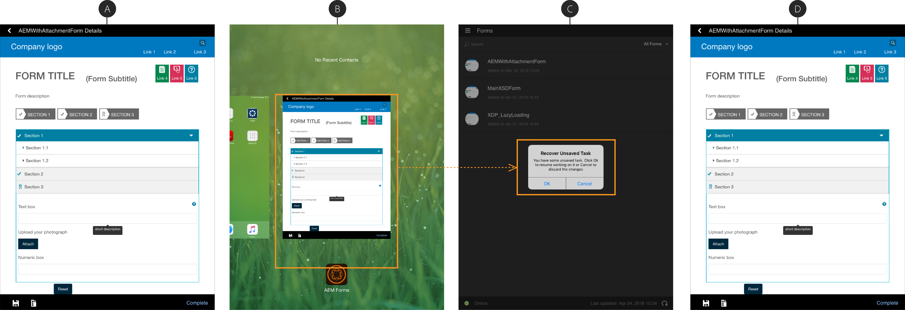

# AEM Forms 앱에서 자동 저장 사용{#using-autosave-in-aem-forms-app}

사용자가 Adobe Experience Manager Forms 앱에 데이터를 입력하면 자동 저장 기능이 정기적으로 데이터를 저장합니다. AEM Forms 앱의 자동 저장 기능을 사용하면 앱이 실수로 닫힌 경우 데이터 손실을 방지할 수 있습니다.

앱이 실수로 닫힐 수 있음:

* 배터리 부족으로 인해 장치가 종료되는 경우
* 사용자가 앱을 종료하는 경우
* 예기치 않은 충돌이 발생하는 경우

앱이 입력한 데이터를 저장하는 간격을 지정할 수 있습니다.

>[!NOTE]
>
>신중하게 자동 저장 빈도 를 선택합니다. 자동 저장 작업을 자주 수행하면 디바이스의 성능에 상당한 영향을 줄 수 있습니다.

AEM Forms 앱의 자동 저장 기능을 사용하려면 다음 단계를 수행하십시오.

1. 앱에 로그인하고 **설정 > 일반**(으)로 이동합니다.
1. 일반 화면에서 **자동 저장 빈도** 옵션을 사용하여 앱이 입력된 데이터를 저장할 간격을 선택합니다.
   

1. 앱을 다시 시작하고 동일한 사용자로 로그인하면 [저장하지 않은 작업 복구] 대화 상자에서 작업을 복원하라는 메시지가 표시됩니다. 저장하지 않은 작업 복구 대화 상자에서 **확인**&#x200B;을 클릭하여 저장된 작업 작업을 다시 시작합니다. **취소**&#x200B;를 클릭하여 마지막으로 트리거된 자동 저장에 해당하는 저장된 데이터를 삭제하고 새 작업 작업을 시작할 수 있습니다.

   **확인**을 클릭하면 앱이 충돌하기 전에 트리거된 최신 자동 저장에 해당하는 데이터로 작업이 복원됩니다. 여기에는 양식 데이터 및 작업과 연결된 모든 첨부 파일이 포함됩니다.
   **A.** 진행 중인 작업 양식 **B.** 앱이 강제로 **C.** 앱을 닫았습니다. 저장하지 않은 작업 복구 대화 상자 **D.** 양식이 원본 데이터로 복원되었습니다.
