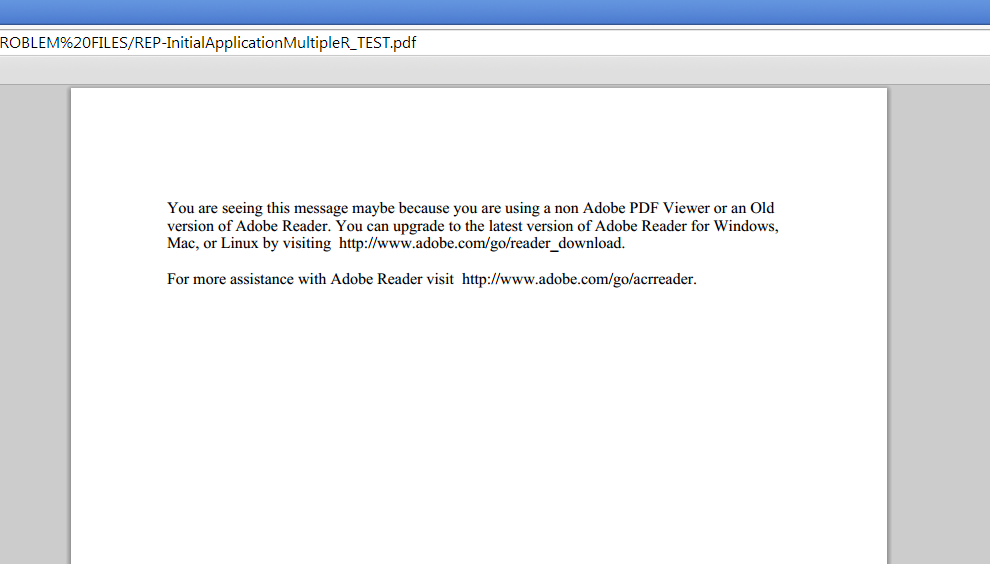

# Designer에서 Page Zero 콘텐츠 변경 {#changing-page-zero-content-in-designer}

[!DNL Chrome] 또는 [!DNL Firefox]의 기본 PDF 뷰어와 같이 Adobe PDF이 아닌 뷰어가 PDF/XFA 양식의 콘텐츠를 읽을 수 없는 경우 기본적으로 Page Zero 콘텐츠가 표시됩니다. 기본 Page Zero 메시지가 아래에 표시됩니다.

[!DNL AEM Forms] 버전의 Designer을 사용하면 0페이지에 표시되는 메시지를 변경할 수 있습니다. Page Zero 메시지를 변경하려면 다음 단계를 수행합니다.

1. [!DNL AEM Forms] 버전의 Designer이 설치되어 있는지 확인하십시오. 디자이너의 정보 화면에서 버전을 확인할 수 있습니다.

1. Page Zero 콘텐츠를 변경할 양식을 엽니다.

1. **[!UICONTROL 파일]** > **[!UICONTROL 양식 속성]**&#x200B;을 클릭합니다.

1. [!UICONTROL 양식 속성] 대화 상자에서 (더하기 아이콘)을 클릭하여 사용자 지정 속성을 추가합니다.

1. **_pagezerocontent**&#x200B;을(를) 속성 이름으로 지정합니다.
1. 새 Page Zero 메시지를 서식 있는 텍스트 형식으로 값으로 추가합니다. 예:

   `<body xmlns="http://www.w3.org/1999/xhtml" xmlns:xfa="http://www.xfa.org/schema/xfa-data/1.0/">
 

You are seeing this message maybe because you are using a non Adobe PDF Viewer or an Old version of Adobe Reader. You can upgrade to the latest version of Adobe Reader for Windows, Mac, or Linux by visiting  https://www.adobe.com/go/reader_download_kr.

 

For more assistance with Adobe Reader visit  https://www.adobe.com/go/acrreader_kr.
</body>`

1. 양식을 PDF으로 저장합니다.

1. 브라우저에서 PDF 양식을 보고 메시지가 업데이트되었는지 확인합니다. 위의 예제 값은 다음과 같이 표시됩니다.

   

>[!NOTE]
>
>만든 사용자 지정 속성은 양식을 다시 열 때 양식 속성 대화 상자에 제대로 표시되지 않을 수 있습니다. 그러나 제대로 작동하며 양식에 업데이트된 Page Zero 메시지가 표시됩니다.
