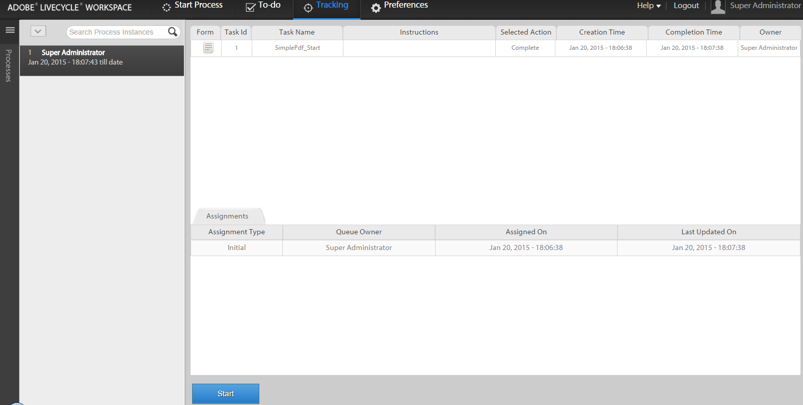

# AEM Forms Workspace에서 기존 프로세스 데이터로 새 프로세스 시작{#initiating-a-new-process-with-existing-process-data-in-aem-forms-workspace}

기존 프로세스 데이터의 데이터를 사용하여 새 프로세스를 시작할 수 있습니다. 기존 프로세스 데이터에서 새 프로세스를 시작해야 하는 이유는 유료 휴가 양식 처럼 내용이 거의 변경되지 않은 상태에서 동일한 양식을 자주 사용해야 할 때 발생합니다. 이 기능을 사용하면 특히 프로세스에 채울 양식이 긴 경우 사용자의 시간과 노력을 절약할 수 있습니다.

다음은 기존 프로세스 데이터에서 새 프로세스를 시작하는 단계입니다.

1. 다음 작업 중 하나를 수행합니다.

   * 추적에서 사용할 데이터가 있는 프로세스 인스턴스를 클릭합니다. 오른쪽 창의 프로세스 기록 보기에서 시작점에 해당하는 작업 행을 클릭합니다.
   * 추적에서 검색 템플릿을 선택하여 프로세스 인스턴스 목록을 표시합니다. 데이터를 사용할 인스턴스를 선택합니다.
   * **[!UICONTROL 할 일]** 탭에서 작업을 선택합니다. **[!UICONTROL 기록]** 탭을 클릭하고 프로세스 인스턴스를 시작한 작업을 선택합니다.

    

1. 작업 작업 도구 모음에서 **[!UICONTROL 시작]**&#x200B;을 클릭합니다. 새 프로세스 인스턴스에 대한 적응형 양식에 미리 채워진 데이터가 표시됩니다.

1. 필요에 따라 데이터를 업데이트하고 **[!UICONTROL 완료]** 또는 양식에서 적절한 단추를 클릭합니다.
