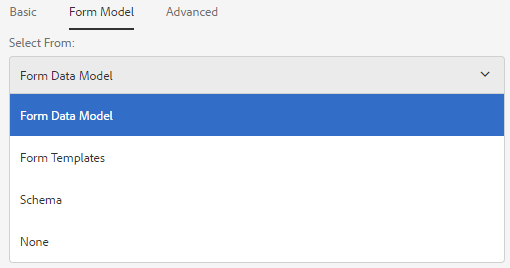
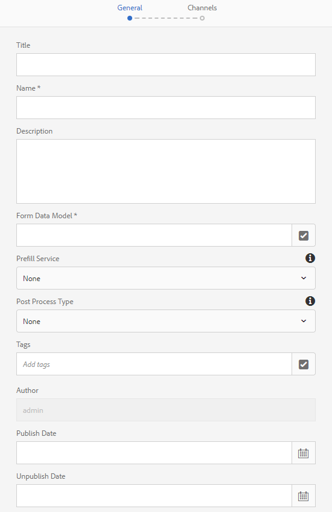

# 양식 데이터 모델 사용{#use-form-data-model}

| 버전 | 문서 링크 |
| -------- | ---------------------------- |
| AEM as a Cloud Service | [여기 클릭](https://experienceleague.adobe.com/docs/experience-manager-cloud-service/content/forms/integrate/use-form-data-model/using-form-data-model.html) |
| AEM 6.5 | 이 문서 |

AEM Forms 데이터 통합을 사용하면 다양한 백엔드 데이터 소스를 사용하여 다양한 적응형 양식 및 대화형 통신 워크플로우에서 스키마로 사용할 수 있는 양식 데이터 모델을 만들 수 있습니다. 데이터 소스에서 사용할 수 있는 데이터 모델 개체 및 서비스를 기반으로 데이터 소스를 구성하고 양식 데이터 모델을 만들어야 합니다. 자세한 내용은 다음을 참조하십시오.

* [AEM Forms 데이터 통합](../../forms/using/data-integration.md)
* [데이터 소스 구성](../../forms/using/configure-data-sources.md)
* [양식 데이터 모델 만들기](../../forms/using/create-form-data-models.md)
* [양식 데이터 모델 작업](../../forms/using/work-with-form-data-model.md)

양식 데이터 모델은 다음과 같은 작업에 사용할 수 있는 JSON 스키마의 확장입니다.

* [적응형 양식 및 단편 만들기](#create-af)
* [대화형 통신 및 텍스트, 목록, 조건 조각과 같은 빌딩 블록 만들기](#create-ic)
* [샘플 데이터를 사용하여 대화형 통신 미리 보기](#preview-ic)
* [적응형 양식 및 대화형 커뮤니케이션 미리 채우기](#prefill)
* [제출된 적응형 양식 데이터를 데이터 소스에 다시 쓰기](#write-af)
* [적응형 양식 규칙을 사용하여 서비스 호출](#invoke-services)

## 적응형 양식 및 단편 만들기 {#create-af}

양식 데이터 모델을 기반으로 [적응형 양식](../../forms/using/creating-adaptive-form.md) 및 [적응형 양식 조각](../../forms/using/adaptive-form-fragments.md)을 만들 수 있습니다. 적응형 양식 또는 적응형 양식 단편을 만들 때 양식 데이터 모델을 사용하려면 다음을 수행하십시오.

1. 속성 추가 화면의 양식 모델 탭에서 **[!UICONTROL 다음에서 선택]** 드롭다운 목록에서 **[!UICONTROL 양식 데이터 모델]**&#x200B;을(를) 선택합니다.

   

1. **[!UICONTROL 양식 데이터 모델 선택]**&#x200B;을 확장하려면 선택하십시오. 사용 가능한 모든 양식 데이터 모델이 나열됩니다.

   데이터 모델에서 을(를) 선택합니다.

   

1. (**적응형 양식 조각만**) 양식 데이터 모델에서 하나의 데이터 모델 개체만 기반으로 적응형 양식 조각을 만들 수 있습니다. **[!UICONTROL 양식 데이터 모델 정의]** 드롭다운을 확장합니다. 지정된 양식 데이터 모델의 모든 데이터 모델 개체를 나열합니다. 목록에서 데이터 모델 개체를 선택합니다.

   

양식 데이터 모델을 기반으로 하는 적응형 양식 또는 적응형 양식 조각이 만들어지면 적응형 양식 편집기에서 양식 데이터 모델 개체가 콘텐츠 브라우저의 **[!UICONTROL 데이터 모델 개체]** 탭에 나타납니다.

>[!NOTE]
>
>적응형 양식 조각의 경우 작성 시 선택한 데이터 모델 개체 및 연관된 데이터 모델 개체만 데이터 모델 개체 탭에 나타납니다.

데이터 모델 개체를 적응형 양식 또는 조각으로 드래그 앤 드롭하여 양식 필드를 추가할 수 있습니다. 추가된 양식 필드는 메타데이터 속성 및 데이터 모델 개체 속성을 사용한 바인딩을 유지합니다. 바인딩을 사용하면 양식을 제출할 때 해당 데이터 소스에서 필드 값을 업데이트하고 양식을 렌더링할 때 미리 채워집니다.

## 대화형 통신 만들기 {#create-ic}

양식 데이터 모델을 기반으로 대화형 통신을 만들어 구성된 데이터 소스의 데이터로 대화형 통신을 미리 채울 수 있습니다. 또한 텍스트, 목록 및 조건 문서 조각과 같은 대화형 통신의 빌딩 블록은 양식 데이터 모델을 기반으로 할 수 있습니다.

대화형 통신 또는 문서 조각을 만들 때 양식 데이터 모델을 선택할 수 있습니다. 다음 이미지는 대화형 통신 만들기 대화 상자의 일반 탭을 보여 줍니다.

대화형 통신 만들기 대화 상자의 일반 탭

자세한 내용은 다음 문서를 참조하십시오.

[대화형 통신 만들기](../../forms/using/create-interactive-communication.md)

[대화형 커뮤니케이션의 텍스트](/help/forms/using/texts-interactive-communications.md)

[대화형 통신의 조건](/help/forms/using/conditions-interactive-communications.md)

[목록 조각](/help/forms/using/lists.md)

## 샘플 데이터로 미리 보기 {#preview-ic}

양식 데이터 모델 편집기를 사용하면 양식 데이터 모델에서 데이터 모델 개체에 대한 샘플 데이터를 생성하고 편집할 수 있습니다. 이 데이터를 사용하여 대화형 통신 및 적응형 양식을 미리 보고 테스트할 수 있습니다. [양식 데이터 모델 작업](../../forms/using/work-with-form-data-model.md#sample)에 설명된 대로 미리 보기 전에 샘플 데이터를 생성합니다.

샘플 양식 데이터 모델 데이터를 사용하여 대화형 통신을 미리 보려면 다음을 수행합니다.

1. AEM 작성자 인스턴스에서 **[!UICONTROL Forms > Forms 및 문서]**&#x200B;로 이동합니다.
1. 대화형 통신을 선택하고 도구 모음에서 **[!UICONTROL 미리 보기]**&#x200B;를 선택하여 대화형 통신을 미리 보려면 **[!UICONTROL 웹 채널]**, **[!UICONTROL 인쇄 채널]** 또는 **[!UICONTROL 두 채널]**&#x200B;을 선택하십시오.
1. 미리 보기 [*채널*] 대화 상자에서 **[!UICONTROL 양식 데이터 모델의 데이터 테스트]**&#x200B;를 선택했는지 확인하고 **[!UICONTROL 미리 보기]**&#x200B;를 선택합니다.

미리 채워진 샘플 데이터로 대화형 통신이 열립니다.

마찬가지로 샘플 데이터가 있는 적응형 양식을 미리 보려면 작성자 모드에서 적응형 양식을 열고 **[!UICONTROL 미리 보기]**&#x200B;를 선택하십시오.

## 양식 데이터 모델 서비스를 사용하여 미리 채우기 {#prefill}

AEM Forms은 양식 데이터 모델을 기반으로 하는 적응형 양식 및 대화형 커뮤니케이션에 대해 활성화할 수 있는 기본 양식 데이터 모델 미리 채우기 서비스를 제공합니다. 미리 채우기 서비스는 적응형 양식 및 대화형 통신에서 데이터 모델 개체에 대한 데이터 소스를 쿼리하며, 이에 따라 양식을 렌더링하거나 통신을 렌더링하는 동안 데이터를 미리 채웁니다.

적응형 양식에 대해 양식 데이터 모델 미리 채우기 서비스를 사용하려면 적응형 양식 컨테이너 속성을 열고 기본 아코디언의 **[!UICONTROL 미리 채우기 서비스]** 드롭다운에서 **[!UICONTROL 양식 데이터 모델 미리 채우기 서비스]**&#x200B;를 선택합니다. 그런 다음 속성을 저장합니다.

대화형 통신에서 양식 데이터 모델 미리 채우기 서비스를 구성하려면 미리 채우기 서비스 드롭다운에서 양식 데이터 모델 미리 채우기 서비스를 선택하거나 나중에 속성을 수정하여 미리 채우기 서비스를 만들 수 있습니다.

대화형 통신을 위한 속성 편집 대화 상자

## 제출된 적응형 양식 데이터를 데이터 소스에 쓰기 {#write-af}

사용자가 양식 데이터 모델을 기반으로 양식을 제출할 때 데이터 모델 개체에 대해 제출된 데이터를 해당 데이터 소스에 기록하도록 양식을 구성할 수 있습니다. 이 사용 사례를 달성하기 위해 AEM Forms은 양식 데이터 모델을 기반으로 하는 적응형 양식에만 즉시 사용할 수 있는 [양식 데이터 모델 제출 액션](../../forms/using/configuring-submit-actions.md)을 제공합니다. 데이터 소스에 데이터 모델 개체에 대해 제출된 데이터를 기록합니다.

양식 데이터 모델 제출 액션을 구성하려면 적응형 양식 컨테이너 속성을 열고 제출 아코디언 아래의 제출 액션 드롭다운에서 **[!UICONTROL 양식 데이터 모델을 사용하여 제출]**&#x200B;을 선택합니다. 그런 다음 **[!UICONTROL 전송할 데이터 모델 개체의 이름]** 드롭다운에서 데이터 모델 개체를 찾아 선택합니다. 속성을 저장합니다.

양식 제출 시 구성된 데이터 모델 개체의 데이터가 해당 데이터 소스에 기록됩니다.

이진 데이터 모델 개체 속성을 사용하여 데이터 소스에 양식 첨부 파일을 제출할 수도 있습니다. 다음을 수행하여 첨부 파일을 JDBC 데이터 소스에 제출합니다.

1. 양식 데이터 모델에 이진 속성을 포함하는 데이터 모델 개체를 추가합니다.
1. 적응형 양식에서 구성 요소 브라우저에서 **[!UICONTROL 파일 첨부]** 구성 요소를 적응형 양식으로 드래그 앤 드롭합니다.
1. 추가된 구성 요소를 선택하려면 선택하고 구성 요소의 속성 브라우저를 열려면 을(를) 선택하십시오.
1. 바인드 참조 필드에서 을(를) 선택하고 양식 데이터 모델에 추가한 이진 속성을 선택하여 이동합니다. 필요에 따라 다른 속성을 구성합니다.

   속성을 저장하려면 를 선택하세요. 이제 첨부 파일 필드가 양식 데이터 모델의 이진 속성에 바인딩됩니다.

1. 적응형 양식 컨테이너 속성의 제출 섹션에서 **[!UICONTROL 양식 첨부 파일 제출]**&#x200B;을 사용하도록 설정합니다. 양식을 제출할 때 이진 속성 필드의 첨부 파일을 데이터 소스에 제출합니다.

## 규칙을 사용하여 적응형 양식에서 서비스 호출 {#invoke-services}

양식 데이터 모델을 기반으로 하는 적응형 양식에서는 [규칙을 만들고](../../forms/using/rule-editor.md) 양식 데이터 모델에 구성된 서비스를 호출할 수 있습니다. 규칙의 **[!UICONTROL 서비스 호출]** 작업은 양식 데이터 모델에서 사용 가능한 모든 서비스를 나열하고 서비스에 대한 입력 및 출력 필드를 선택할 수 있도록 해줍니다. **값 설정** 규칙 유형을 사용하여 양식 데이터 모델 서비스를 호출하고 필드의 값을 서비스에서 반환된 출력으로 설정할 수도 있습니다.

예를 들어, 다음 규칙은 직원 ID를 입력으로 취하며 반환된 값이 양식의 해당 종속 ID, 성, 이름 및 성별 필드에 채워지는 get 서비스를 호출합니다.

또한 `guidelib.dataIntegrationUtils.executeOperation` API를 사용하여 규칙 편집기의 코드 편집기에서 JavaScript을 작성할 수 있습니다. API 세부 정보는 [양식 데이터 모델 서비스를 호출하는 API](/help/forms/using/invoke-form-data-model-services.md)를 참조하십시오.
