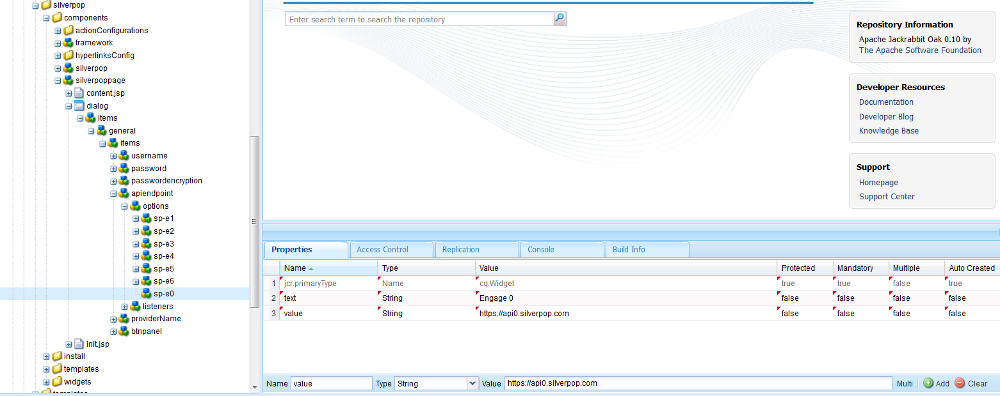

# Silverpop Engage와 통합{#integrating-with-silverpop-engage}

<!-- THIS ENTIRE TOPIC APPEARS OBSOLETE BECAUSE SILVERPOP NO LONGER EXISTS AND THERE ARE NO REDIRECTS FOR THE DOWNLOAD URL BELOW THAT IS 404.
>[!NOTE]
>
>Silverpop integration is **not** available out of the box. Download the Silverpop integration package `https://www.adobeaemcloud.com/content/marketplace/marketplaceProxy.html?packagePath=/content/companies/public/adobe/packages/aem620/product/cq-mcm-integrations-silverpop-content` from Package Share and install it on your instance. After you have installed the package, you can configure it as described in this document. -->

AEM과 Silverpop Engage를 통합하면 Silverpop을 통해 AEM에서 만든 이메일을 관리하고 보낼 수 있습니다. 또한 AEM 페이지의 AEM Forms를 통해 Silverpop의 리드 관리 기능을 사용할 수 있습니다.

통합은 다음과 같은 기능을 제공합니다.

* AEM에서 이메일을 만들고 배포를 위해 Silverpop에 게시하는 기능입니다.
* Silverpop 구독자를 만들기 위해 AEM 양식의 작업을 설정하는 기능입니다.

Silverpop Engage가 구성되면 Silverpop Engage에 뉴스레터 또는 이메일을 게시할 수 있습니다.

## Silverpop 구성 만들기 {#creating-a-silverpop-configuration}

Silverpop 구성은 **클라우드 서비스**, **도구** 또는 **API 끝점**&#x200B;을 통해 추가할 수 있습니다. 모든 방법은 이 섹션에 설명되어 있습니다.

### Cloud Services를 통해 Silverpop 구성 {#configuring-silverpop-via-cloudservices}

Cloud Services에서 Silverpop 구성을 만들려면 다음을 수행하십시오.

1. AEM에서 **도구** > **배포** > **클라우드 서비스**&#x200B;를 클릭합니다. 또는 `https://<hostname>:<port>/etc/cloudservices.html`에서 직접 액세스할 수 있습니다.
1. 타사 서비스에서 **Silverop 참여**&#x200B;를 클릭한 다음 **구성**&#x200B;을 클릭합니다. Silverpop 구성 창이 열립니다.

   >[!NOTE]
   >
   >Silverpop Engage는 패키지 공유에서 패키지를 다운로드하지 않으면 서드파티 서비스에서 옵션으로 사용할 수 없습니다.

1. 제목과 이름을 입력하고 **만들기**&#x200B;를 클릭합니다. ** Silverpop 설정** 구성 창이 열립니다.
1. 사용자 이름 및 암호를 입력하고 드롭다운 목록에서 API 엔드포인트를 선택합니다.
1. **Silverpop에 연결을 클릭합니다.** 연결되면 성공 대화 상자가 표시됩니다. 창을 종료하려면 **확인**&#x200B;을 클릭하세요. **Silverpop Engage로 이동**&#x200B;을 클릭하여 Silverpop으로 이동할 수 있습니다.
1. Silverpop이 구성되었습니다. **편집**&#x200B;을 클릭하여 구성을 편집할 수 있습니다.
1. 또한 제목 및 이름(선택 사항)을 제공하여 개인화된 작업에 대해 Silverpop Engage 프레임워크를 구성할 수 있습니다. 만들기 를 클릭하면 이미 구성된 Silverpop 연결에 대한 프레임워크가 성공적으로 만들어집니다.

   가져온 데이터 확장 열은 나중에 AEM 구성 요소(**Text 및 Personalization**)를 통해 사용할 수 있습니다.

### 도구를 통해 Silverpop 구성 {#configuring-silverpop-via-tools}

도구에서 Silverpop 구성을 만들려면 다음 작업을 수행하십시오.

1. AEM에서 **도구** > **배포** > **클라우드 서비스**&#x200B;를 클릭합니다. 또는 `https://<hostname>:<port>/misadmin#/etc`(으)로 이동하여 바로 탐색하십시오.
1. **도구**, **클라우드 서비스 구성,**, **Silverpop Engage**&#x200B;를 선택하십시오.
1. **새로 만들기**&#x200B;를 클릭합니다.

   

1. **페이지 만들기** 창에서 **제목** 및 **이름**(선택 사항)을 입력하고 **만들기**&#x200B;를 클릭합니다.
1. 이전 절차의 4단계에 설명된 대로 구성 정보를 입력합니다. Silverpop 구성을 완료할 수 있도록 해당 절차를 따르십시오.

### 여러 구성 추가 {#adding-multiple-configurations}

여러 구성을 추가하려면 다음 작업을 수행하십시오.

1. 시작 페이지에서 **클라우드 서비스**&#x200B;를 클릭하고 **Silverpop 참여**&#x200B;를 클릭합니다. Silverpop 구성을 하나 이상 사용할 수 있는 경우 표시되는 **구성 표시** 단추를 클릭합니다. 사용 가능한 모든 구성이 나열됩니다.
1. 사용 가능한 구성 옆에 있는 **+** 기호를 클릭합니다. **구성 만들기** 창이 열립니다. 구성을 만들 수 있도록 이전 구성 절차를 따르십시오.

### Silverpop에 연결하기 위한 API 끝점 구성 {#configuring-api-end-points-for-connecting-to-silverpop}

현재 AEM에는 6개의 보안되지 않은 엔드포인트가 있습니다(참여 1 - 6). 이제 Silverpop에서는 두 개의 새로운 끝점과 기존 끝점에 대해 변경된 연결 끝점을 제공합니다.

API 끝점을 구성하려면 다음 작업을 수행하십시오.

1. `https://<hostname>:<port>/crxde.`의 `/libs/mcm/silverpop/components/silverpoppage/dialog/items/general/items/apiendpoint/options node`(으)로 이동
1. 마우스 오른쪽 단추를 클릭하고 **만들기**&#x200B;를 선택한 다음 **노드 만들기**&#x200B;를 선택합니다.
1. **이름**&#x200B;을(를) `sp-e0`(으)로 입력하고 **유형**&#x200B;을(를) `cq:Widget`(으)로 선택하십시오.
1. 새로 추가된 노드에 다음 두 가지 속성을 추가합니다.

   1. **이름**: `text`, **유형**: `String`, **값**: `Engage 0`
   1. **이름**: `value`, **유형**: `String`, **값**: `https://api0.silverpop.com`

   

   &quot;모두 저장&quot;을 클릭합니다.

1. **Name**&#x200B;을(를) `sp-e7`(으)로 사용하고 **Type**&#x200B;을(를) `cq:Widget`(으)로 사용하는 노드를 하나 더 만듭니다.

   새로 추가된 노드에 다음 두 가지 속성을 추가합니다.

   1. **이름**: `text`, **유형**: `String`, **값**: `Pilot`
   1. **이름**: `value`, **유형**: `String`, **값**: `https://apipilot.silverpop.com/XMLAPI`

1. 기존 API 끝점(참여 1 - 6)을 변경하려면 각 끝점을 하나씩 클릭하고 값을 다음과 같이 바꿉니다.

   | **노드 이름** | **기존 끝점 값** | **새 끝점 값** |
   |---|---|---|
   | sp-e1 | `https://api.engage1.silverpop.com/XMLAPI` | `https://api1.silverpop.com` |
   | sp-e2 | `https://api.engage2.silverpop.com/XMLAPI` | `https://api2.silverpop.com` |
   | sp-e3 | `https://api.engage3.silverpop.com/XMLAPI` | `https://api3.silverpop.com` |
   | sp-e4 | `https://api.engage4.silverpop.com/XMLAPI` | `https://api4.silverpop.com` |
   | sp-e5 | `https://api.engage5.silverpop.com/XMLAPI` | `https://api5.silverpop.com` |
   | sp-e6 | `https://api.pilot.silverpop.com/XMLAPI` | `https://api6.silverpop.com` |

1. **모두 저장**&#x200B;을 클릭합니다. 이제 AEM에서 보안 끝점을 통해 Silverpop에 연결할 준비가 되었습니다.

   
