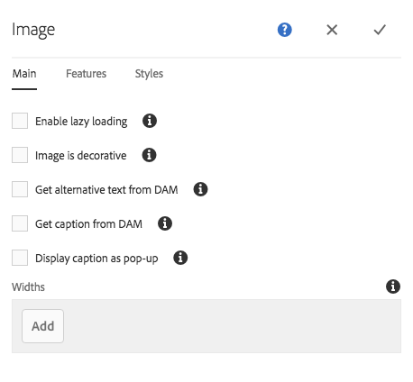

# 디자인 모드에서 기본 구성 요소 구성{#configuring-components-in-design-mode}

AEM 인스턴스가 기본적으로 설치되면 구성 요소 브라우저에서 다양한 구성 요소를 즉시 사용할 수 있습니다.

이들 외에도 다양한 다른 구성 요소도 사용할 수 있습니다. 디자인 모드를 사용하여 [이러한 구성 요소를 활성화/비활성화](#enable-disable-components)할 수 있습니다. 활성화하여 페이지에 있는 경우 특성 매개 변수를 편집하여 디자인 모드를 사용하여 [구성 요소 디자인의 측면을 구성](#configuring-the-design-of-a-component)할 수 있습니다.

>[!NOTE]
>
>이러한 구성 요소를 편집할 때는 주의해야 합니다. 디자인 설정은 종종 전체 웹 사이트 디자인의 필수적인 부분이므로 적절한 권한과 경험을 가진 사람(관리자 또는 개발자)만 변경해야 합니다. 자세한 내용은 [구성 요소 개발](/help/sites-developing/components.md)을 참조하세요.

>[!NOTE]
>
>디자인 모드는 정적 템플릿에만 사용할 수 있습니다. 편집 가능한 템플릿으로 만든 템플릿은 [템플릿 편집기](/help/sites-authoring/templates.md)를 사용하여 편집해야 합니다.

>[!NOTE]
>
>디자인 모드는 (`/etc`)의 콘텐츠로 저장된 디자인 구성에만 사용할 수 있습니다.
>
>AEM 6.4부터 디자인을 구성 데이터로 `/apps`에 저장하여 지속적인 배포 시나리오를 지원하는 것이 좋습니다. `/apps`에 저장된 디자인을 런타임에 편집할 수 없으며 관리자가 아닌 사용자는 이러한 템플릿에 디자인 모드를 사용할 수 없습니다.

이 작업에는 페이지의 단락 시스템에서 허용되는 구성 요소를 추가하거나 제거하는 작업이 포함됩니다. 단락 시스템(`parsys`)은 다른 모든 단락 구성 요소를 포함하는 복합 구성 요소입니다. 단락 시스템을 사용하면 작성자가 다른 모든 단락 구성 요소를 포함하므로 페이지에 다른 유형의 구성 요소를 추가할 수 있습니다. 각 단락 유형은 구성 요소로 표시됩니다.

예를 들어 제품 페이지의 콘텐츠에는 다음을 포함하는 단락 시스템이 포함될 수 있습니다.

* 제품 이미지(이미지 또는 텍스트 단락 형태)
* 제품 설명(텍스트 단락)
* 기술 데이터가 포함된 표(표 단락으로 표시)
* 양식 사용자가 작성(양식 시작 시, 양식 요소 및 양식 끝 단락)

>[!NOTE]
>
>`parsys`에 대한 자세한 내용은 [구성 요소 개발](/help/sites-developing/components.md) 및 [템플릿 및 구성 요소 사용 지침](/help/sites-developing/dev-guidelines-bestpractices.md#guidelines-for-using-templates-and-components)을 참조하십시오.

>[!CAUTION]
>
>이 문서에 설명된 대로 디자인 모드를 사용하여 디자인을 편집하면 정적 템플릿의 디자인을 정의하는 데 권장됩니다
>
>예를 들어 CRX DE에서 디자인을 수정하는 것은 모범 사례가 아니며, 이러한 디자인의 적용은 예상되는 비헤이비어와 다를 수 있습니다.

## 구성 요소 활성화/비활성화 {#enable-disable-components}

구성 요소를 활성화 또는 비활성화하려면 다음을 수행하십시오.

1. **디자인** 모드를 선택하십시오.

   

1. 구성 요소를 클릭합니다. 선택하면 구성 요소에 파란색 테두리가 표시됩니다.

   

1. **상위** 아이콘을 클릭합니다.

   

   이렇게 하면 현재 구성 요소가 포함된 단락 시스템이 선택됩니다.

1. 단락 시스템의 **구성** 아이콘이 부모의 작업 표시줄에 표시됩니다.

   

   이 옵션을 선택하면 대화 상자가 표시됩니다.

1. 대화 상자를 통해 현재 페이지를 편집할 때 구성 요소 브라우저에서 사용할 수 있는 구성 요소를 정의할 수 있습니다.

   

   이 대화 상자에는 두 개의 탭이 있습니다.

   * 허용된 구성 요소
   * 설정

   **허용된 구성 요소**

   **허용된 구성 요소** 탭에서 parsys에 사용할 수 있는 구성 요소를 정의합니다.

   * 구성 요소는 확장 및 축소할 수 있는 구성 요소 그룹별로 그룹화됩니다.
   * 그룹 이름을 체크 표시하여 전체 그룹을 선택할 수 있으며, 체크 표시를 해제하여 전체 그룹을 선택 취소할 수 있습니다.
   * 빼기 기호는 그룹의 항목이 하나 이상 선택되어 있음을 나타냅니다.
   * 검색을 통해 구성 요소를 이름별로 필터링할 수 있습니다.
   * 구성 요소 그룹 이름의 오른쪽에 나열된 숫자는 필터와 관계없이 해당 그룹에서 선택한 구성 요소의 총 개수를 나타냅니다.

   페이지 구성 요소별 구성을 정의합니다. 하위 페이지가 동일한 템플릿 및/또는 페이지 구성 요소를 사용하는 경우(일반적으로 정렬됨) 해당 단락 시스템에도 동일한 구성이 적용됩니다.

   >[!NOTE]
   >
   >적응형 양식 구성 요소는 Forms 에코시스템을 사용하기 위해 적응형 양식 컨테이너 내에서 작동하도록 설계되었습니다. 따라서 이러한 구성 요소는 적응형 양식 편집기에서만 사용해야 하며 Sites 페이지 편집기에서는 작동하지 않습니다.

   **설정**

   **설정** 탭에서 각 구성 요소에 대한 앵커를 그리고 각 컨테이너의 셀 패딩을 정의하는 등의 추가 옵션을 정의할 수 있습니다.

1. **완료**&#x200B;를 선택하여 구성을 저장합니다.

## 구성 요소 디자인 구성 {#configuring-the-design-of-a-component}

1. **디자인** 모드를 선택하십시오.

   

1. 파란색 테두리가 있는 구성 요소를 클릭합니다. 이 예에서는 영웅 이미지 구성 요소가 선택됩니다.

   

1. **구성** 아이콘을 사용하여 대화 상자를 엽니다.

   

   디자인 대화 상자에서 사용 가능한 디자인 매개 변수에 따라 구성 요소를 구성할 수 있습니다.

   

   이 대화 상자에는 세 개의 탭이 있습니다.

   * 기본
   * 기능
   * 스타일

   **속성**

   **속성** 탭에서는 구성 요소의 중요한 디자인 매개 변수를 구성할 수 있습니다. 예를 들어 이미지 구성 요소의 경우 허용되는 이미지의 최대 및 최소 크기를 정의할 수 있습니다.

   **기능**

   **기능** 탭에서는 구성 요소의 추가 기능을 활성화하거나 비활성화할 수 있습니다. 예를 들어 이미지 구성 요소의 경우 이미지의 방향, 사용 가능한 자르기 옵션 및 이미지를 업로드할 수 있는지 여부를 정의할 수 있습니다.

   **스타일**

   **스타일** 탭에서는 구성 요소와 함께 사용할 CSS 클래스와 스타일을 정의할 수 있습니다.

   

   **추가** 단추를 사용하여 다중 항목 대화 상자 목록에 항목을 추가하십시오.

   

   **삭제** 아이콘을 사용하여 다중 항목 대화 상자 목록에서 항목을 제거하십시오.

   

   **이동** 아이콘을 사용하여 다중 항목 대화 상자 목록의 항목 순서를 재배열합니다.

   

1. **완료** 아이콘을 클릭하여 저장하고 대화 상자를 닫습니다.
