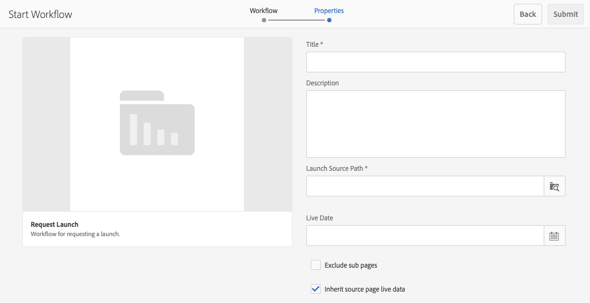

# 프로젝트 워크플로를 사용하여 작업 {#working-with-project-workflows}

즉시 사용 가능한 프로젝트 워크플로는 다음과 같습니다.

* **프로젝트 승인 워크플로** - 이 워크플로를 사용하면 사용자에게 콘텐츠를 할당하고, 검토한 다음 승인할 수 있습니다.
* **론치 요청** - 론치를 요청하는 워크플로입니다.
* **랜딩 페이지 요청** - 이 워크플로는 랜딩 페이지를 요청합니다.
* **요청 이메일** - 이메일을 요청하는 워크플로입니다.
* **제품 사진 촬영 및 제품 사진 촬영(Commerce)** - 에셋을 제품과 매핑
* **DAM 언어 사본 작성 및 번역과 DAM 언어 사본 작성** - 자산 및 폴더에 대한 번역된 바이너리, 메타데이터 및 태그를 생성합니다.

선택하는 프로젝트 템플릿에 따라 사용 가능한 워크플로가 달라집니다.

|   | **간단한 프로젝트** | **미디어 프로젝트** | **제품 사진 촬영 프로젝트** | **번역 프로젝트** |
|---|:-:|:-:|:-:|:-:|
| 요청 복사 |  | x |  |  |
| 제품 사진 촬영 |  | x | x |  |
| 제품 사진 촬영(Commerce) |  |  | x |  |
| 프로젝트 승인 | x |  |  |  |
| 론치 요청 | x |  |  |  |
| 랜딩 페이지 요청 | x |  |  |  |
| 이메일 요청 | x |  |  |  |
| DAM 언어 사본 만들기 |  |  |  | x |
| DAM 언어 사본 만들기 및 번역 |  |  |  | x |

>[!NOTE]
>
>&ast; 이들 워크플로는 프로젝트의 **워크플로** 타일에서 시작되지 않습니다. [에셋용 언어 사본 만들기](/help/sites-administering/tc-manage.md)를 참조하십시오.

워크플로 시작 및 완료 단계는 선택하는 워크플로와 상관없이 동일합니다. 단계만 변경됩니다.

[프로젝트]에서 바로 워크플로를 시작합니다([DAM 언어 사본 작성]이나 [DAM 언어 사본 작성 및 번역] 제외). 프로젝트에서 아직 처리되지 않은 작업에 대한 정보는 **작업** 타일에 나열됩니다. 완료해야 하는 작업에 대한 알림은 사용자 아이콘 옆에 표시됩니다.

AEM에서 워크플로우를 사용하여 작업하는 방법에 대한 자세한 내용은 다음 문서를 참조하십시오.

* [워크플로에 참여](/help/sites-authoring/workflows-participating.md)
* [페이지에 워크플로 적용](/help/sites-authoring/workflows-applying.md)
* [워크플로 구성](/help/sites-administering/workflows.md)

이 섹션에서는 프로젝트에 사용할 수 있는 워크플로에 대해 설명합니다.

## 요청 복사 워크플로 {#request-copy-workflow}

이 워크플로우를 통해 사용자에게 원고를 요청한 다음 승인할 수 있습니다. 요청 복사 워크플로우를 시작하려면 다음을 수행합니다.

1. 미디어 프로젝트에서 **워크플로** 타일의 오른쪽 상단에 있는 아래쪽 V자형 화살표를 클릭하고 **워크플로 시작**&#x200B;을 선택합니다.
1. 워크플로 마법사에서 **복사 요청**&#x200B;을 선택하고 **다음**&#x200B;을 클릭합니다.
1. 원고 제목과 요청하는 내용에 대한 간략한 요약을 입력합니다. 해당하는 경우 대상 단어 수, 작업 우선 순위 및 기한을 입력합니다.

   

1. **제출**&#x200B;을 클릭합니다.

워크플로가 시작됩니다. 작업이 **작업** 카드에 나타납니다.

## 제품 사진 촬영 워크플로우 {#product-photo-shoot-workflow}

**제품 사진 촬영** 워크플로(상거래 및 비상거래)는 [Creative 프로젝트](/help/sites-authoring/managing-product-information.md) 문서에서 자세히 다룹니다

## 프로젝트 승인 워크플로 {#project-approval-workflow}

**프로젝트 승인** 워크플로에서 사용자에게 콘텐츠를 할당하고 검토한 다음 콘텐츠를 승인합니다.

1. 간단한 프로젝트에서 **워크플로** 타일의 오른쪽 상단에 있는 아래쪽 V자형 화살표를 클릭하고 **워크플로 시작**&#x200B;을 선택합니다.
1. 워크플로 마법사에서 **프로젝트 승인 워크플로**&#x200B;를 선택하고 **다음**&#x200B;을 클릭합니다.
1. 제목을 입력하고 할당할 사용자를 선택합니다. 해당하는 경우 설명, 콘텐츠 경로, 작업 우선순위 및 기한을 입력하십시오.

   

1. **제출**&#x200B;을 클릭합니다.

워크플로가 시작됩니다. 작업이 **작업** 카드에 나타납니다.

## 론치 요청 워크플로 {#request-launch-workflow}

이 워크플로에서는 론치를 요청할 수 있습니다.

1. 간단한 프로젝트에서 **워크플로** 타일의 오른쪽 상단에 있는 아래쪽 V자형 화살표를 클릭하고 **워크플로 시작**&#x200B;을 선택합니다.
1. 워크플로 마법사에서 **시작 요청 워크플로**&#x200B;를 선택하고 **다음**&#x200B;을 클릭합니다.
1. 론치의 제목을 입력하고 론치 소스 경로를 제공합니다. 해당하는 경우 설명과 활성 날짜를 추가할 수도 있습니다. 론치가 동작하는 방식에 따라 [소스 페이지의 라이브 데이터 가져오기]나 [하위 페이지 제외]를 선택하십시오.

   

1. **제출**&#x200B;을 클릭합니다.

워크플로가 시작됩니다. 워크플로가 **워크플로** 목록에 나타납니다.

## 랜딩 페이지 요청 워크플로 {#request-landing-page-workflow}

이 워크플로우를 통해 랜딩 페이지를 요청할 수 있습니다.

1. 간단한 프로젝트에서 **워크플로** 타일의 오른쪽 상단에 있는 아래쪽 V자형 화살표를 클릭하고 **워크플로 시작**&#x200B;을 선택합니다.
1. 워크플로 마법사에서 **랜딩 페이지 요청**&#x200B;을(를) 선택하고 **다음**&#x200B;을(를) 클릭합니다.
1. 랜딩 페이지의 제목과 상위 경로를 입력합니다. 해당되는 경우 라이브 날짜를 입력하거나 랜딩 페이지에 사용할 파일을 선택하십시오.

   

1. **제출**&#x200B;을 클릭합니다.

워크플로가 시작됩니다. 작업이 **작업** 카드에 나타납니다.

## 이메일 워크플로 요청 {#request-email-workflow}

이 워크플로우를 사용하면 이메일을 요청할 수 있습니다. **전자 메일** 타일에 나타나는 워크플로와 동일합니다.

1. 간단한 프로젝트에서 **워크플로** 타일의 오른쪽 상단에 있는 아래쪽 V자형 화살표를 클릭하고 **워크플로 시작**&#x200B;을 선택합니다.
1. 워크플로 마법사에서 **전자 메일 요청**&#x200B;을 선택하고 **다음**&#x200B;을 클릭합니다.
1. 이메일 제목, 캠페인 및 템플릿 경로를 입력합니다. 또한 이름, 설명 및 라이브 날짜를 입력할 수 있습니다.

   

1. **제출**&#x200B;을 클릭합니다.

워크플로가 시작됩니다. 작업이 **작업** 카드에 나타납니다.

## 자산용 언어 복사 워크플로 생성(및 번역) {#create-and-translate-language-copy-workflow-for-assets}

**언어 사본 만들기** 및 **언어 사본 만들기 및 번역** 워크플로는 [Assets용 언어 사본 만들기](/help/assets/translation-projects.md) 문서에 자세히 설명되어 있습니다.
