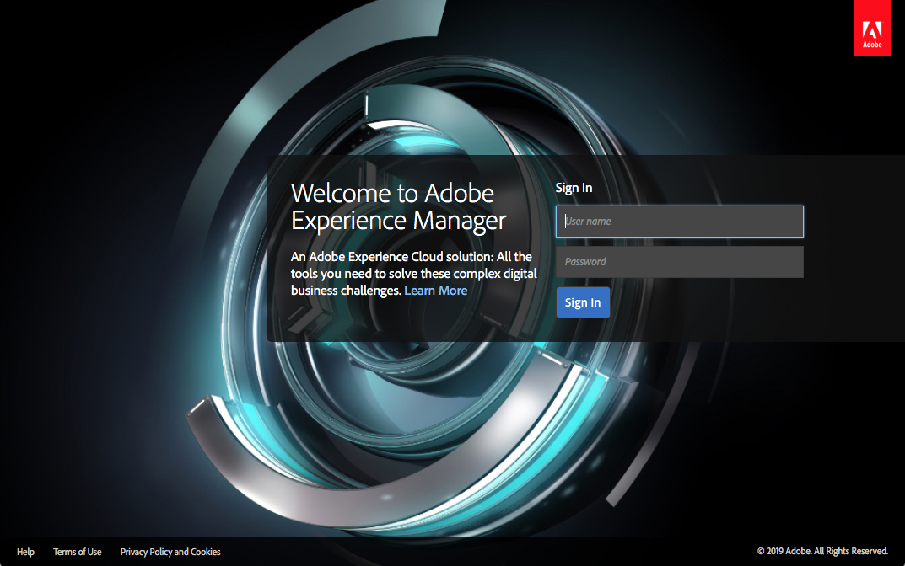

# 배포 및 유지 관리{#deploying-and-maintaining}

이 페이지에서는 다음 정보를 찾을 수 있습니다.

* [기본 개념](#basic-concepts)

   * [AEM란?](#what-is-aem)
   * [일반 배포](#typical-deployment-scenarios)

      * [온프레미스](#on-premise)
      * [Cloud Manager을 사용한 Managed Services](#managed-services-using-cloud-manager)

* [시작하기](#getting-started)

   * [사전 요구 사항](#prerequisites)
   * [소프트웨어 가져오기](#getting-the-software)
   * [기본 로컬 설치](#default-local-install)
   * [작성자 및 게시 설치](#author-and-publish-installs)
   * [압축을 푼 설치 디렉토리](#unpacked-install-directory)
   * [시작 및 중지](#starting-and-stopping)

이러한 기본 사항을 숙지하면 다음 하위 페이지에서 보다 고급 세부 정보를 찾을 수 있습니다.

* [기술 요구 사항](/help/sites-deploying/technical-requirements.md)
* [권장 배포](/help/sites-deploying/recommended-deploys.md)
* [사용자 지정 독립 실행형 설치](/help/sites-deploying/custom-standalone-install.md)
* [Application Server 설치](/help/sites-deploying/application-server-install.md)
* [명령줄 시작 및 중지](/help/sites-deploying/command-line-start-and-stop.md)
* [구성](/help/sites-deploying/configuring.md)
* [AEM 6.5 LTS로 업그레이드](/help/sites-deploying/upgrade.md)
* [구성 방법 문서](/help/sites-deploying/ht-deploy.md)
* [웹 콘솔](/help/sites-deploying/web-console.md)
* [복제 문제 해결](/help/sites-deploying/troubleshoot-rep.md)
* [모범 사례](/help/sites-deploying/best-practices.md)
* [AEM 플랫폼 소개](/help/sites-deploying/platform.md)

## 기본 개념 {#basic-concepts}

### AEM란? {#what-is-aem}

Adobe Experience Manager은 상업용 웹 사이트 및 관련 서비스를 구축, 관리 및 배포하기 위한 웹 기반 클라이언트 서버 시스템입니다. 여러 인프라 수준 및 애플리케이션 수준 기능을 하나의 통합 패키지로 결합합니다.

인프라 수준에서 AEM은 다음을 제공합니다.

* **웹 응용 프로그램 서버**: AEM은 독립 실행형 모드(통합 Jetty 웹 서버 포함)로 배포하거나 타사 응용 프로그램 서버 내의 웹 응용 프로그램으로 배포할 수 있습니다.
* **웹 응용 프로그램 프레임워크**: AEM은 RESTful의 콘텐츠 지향 웹 응용 프로그램 작성을 단순화하는 Sling 웹 응용 프로그램 프레임워크를 통합합니다.
* **콘텐츠 저장소**: AEM에는 구조화되지 않은 데이터 및 반구조화 데이터를 위해 특별히 설계된 계층형 데이터베이스 유형인 JCR(Java™ Content Repository)이 포함되어 있습니다. 저장소는 사용자 대면 콘텐츠뿐만 아니라 애플리케이션에서 사용하는 모든 코드, 템플릿 및 내부 데이터를 저장합니다.

이 기반을 기반으로 구축된 AEM은 또한 관리를 위한 여러 애플리케이션 수준 기능을 제공합니다.

* **웹 사이트**
* **디지털 발행물**
* **Forms 및 문서**
* **디지털 Assets**

마지막으로, 고객은 이러한 인프라와 애플리케이션 수준의 구성 요소를 사용하여 자체 애플리케이션을 구축함으로써 맞춤형 솔루션을 만들 수 있습니다.

AEM 서버는 **Java 기반**&#x200B;이며 해당 플랫폼을 지원하는 대부분의 운영 체제에서 실행됩니다. AEM과의 모든 클라이언트 상호 작용은 **웹 브라우저**&#x200B;를 통해 수행됩니다.

>[!NOTE]
>
>AEM 6.5 LTS QuickStart에서 사용할 수 있는 적응형 Forms 기능은 탐색 및 평가 목적으로만 설계되었습니다. 프로덕션 용도로 사용하려면 적응형 양식 기능에 적절한 라이선싱이 필요하므로 AEM Forms에 대해 유효한 라이선스를 확보해야 합니다.

### 일반적인 배포 시나리오 {#typical-deployment-scenarios}

AEM 용어에서 &quot;인스턴스&quot;는 서버에서 실행되는 AEM의 사본입니다. AEM 설치에는 일반적으로 별도의 컴퓨터에서 실행되는 최소 두 개의 인스턴스가 포함됩니다.

* **작성자**: 콘텐츠를 만들고, 업로드하고, 편집하고, 웹 사이트를 관리하는 데 사용되는 AEM 인스턴스입니다. 콘텐츠를 실행할 준비가 되면 게시 인스턴스에 복제됩니다.
* **게시**: 게시된 콘텐츠를 일반에게 제공하는 AEM 인스턴스입니다.

이러한 인스턴스는 설치된 소프트웨어 측면에서 동일합니다. 구성 단위로만 구분됩니다. 또한 대부분의 설치에서는 Dispatcher을 사용합니다.

* **Dispatcher**: AEM Dispatcher 모듈로 보강된 정적 웹 서버(Apache httpd, Microsoft® IIS 등)입니다. 게시 인스턴스에서 생성된 웹 페이지를 캐시하여 성능을 개선합니다.

이 설정에는 많은 고급 옵션과 정교함이 있지만 대부분의 배포에서 작성자, 게시 및 Dispatcher의 기본 패턴이 핵심입니다. 간단한 설정에 초점을 맞추어 시작하겠습니다. 고급 배포 옵션에 대한 논의는 다음과 같습니다.

다음 섹션에서는 두 가지 시나리오를 설명합니다.

* **온-프레미스**: AEM이 회사 환경에 배포되고 관리됩니다.

* **Managed Services - Adobe Experience Manager용 Cloud Manager**: Adobe Managed Services에서 배포하고 관리하는 AEM.

### 온프레미스 {#on-premise}

회사 환경의 서버에 AEM을 설치할 수 있습니다. 일반적인 설치 인스턴스는 개발, 테스트 및 게시 환경을 포함합니다. AEM 소프트웨어를 로컬에 설치하는 방법에 대한 기본 정보는 [시작하기](#getting-started)를 참조하십시오.

<!-- To learn more about the typical on-premises deployments, see [Recommended Deployments](/help/sites-deploying/recommended-deploys.md). -->

### Cloud Manager을 사용한 Managed Services {#managed-services-using-cloud-manager}

<i>곧 발표될 예정입니다.</i>

## 시작하기 {#getting-started}

### 사전 요구 사항 {#prerequisites}

프로덕션 인스턴스는 공식적으로 지원되는 OS를 실행하는 전용 컴퓨터에서 실행되지만([기술 요구 사항](/help/sites-deploying/technical-requirements.md) 참조), Experience Manager 서버는 실제로 [**Java™ Standard Edition 17**](https://www.oracle.com/java/technologies/downloads/#java17)을 지원하는 모든 시스템에서 실행됩니다.

AEM에 익숙해지고 개발하기 위해 Apple OS X를 실행하는 로컬 시스템이나 Microsoft® Windows 또는 Linux®의 데스크탑 버전을 실행하는 로컬 시스템에 설치된 인스턴스를 사용하는 것이 일반적입니다.

클라이언트측에서 AEM은 데스크톱 및 태블릿 운영 체제에서 모든 최신 브라우저(**Microsoft® Edge**, **Chrome 51+**, **Firefox 47+**, **Safari 8+**)에서 작동합니다. 자세한 내용은 [지원되는 클라이언트 플랫폼](/help/sites-deploying/technical-requirements.md#supported-client-platforms)을 참조하십시오.

### 소프트웨어 가져오기 {#getting-the-software}

유효한 유지 관리 및 지원 계약을 보유한 고객은 코드가 포함된 메일 알림을 받았어야 하며 [**Adobe 라이선스 웹 사이트**](https://licensing.adobe.com/)에서 AEM을 다운로드할 수 있습니다. 비즈니스 파트너는 [**spphelp@adobe.com**](mailto:spphelp@adobe.com)&#x200B;에서 다운로드 액세스를 요청할 수 있습니다.

AEM 소프트웨어 패키지는 두 가지 형태로 제공됩니다.

* **CQ AEM 6.5 LTS jar:** 실행해야 하는 모든 항목이 포함된 독립 실행형 실행 파일 *jar*&#x200B;입니다.

* **CQ AEM 6.5 LTS war:** 타사 응용 프로그램 서버에 배포할 *war* 파일입니다.

다음 섹션에서는 **독립 실행형 설치**&#x200B;에 대해 설명합니다. 응용 프로그램 서버에 AEM을 설치하는 방법에 대한 자세한 내용은 [응용 프로그램 서버 설치](/help/sites-deploying/application-server-install.md)를 참조하십시오.

### 기본 로컬 설치 {#default-local-install}

1. 로컬 컴퓨터에 설치 디렉터리를 만듭니다. 예:

   UNIX® 설치 위치: **/opt/aem**

   Windows 설치 위치: **`C:\Program Files\aem`**

   마찬가지로, 바탕 화면의 오른쪽 폴더에 샘플 인스턴스를 설치하는 것이 일반적입니다. 어떤 경우든 Adobe은 일반적으로 이 위치를 다음과 같이 참조합니다.

   `<aem-install>`

   *파일 디렉터리의 경로는 미국 ASCII 문자로만 구성되어야 합니다.*

1. **jar** 및 **license** 파일을 이 디렉터리에 배치합니다.

   ```shell
   <aem-install>/
       <aem-65-lts>.jar
       license.properties
   ```

   `license.properties` 파일을 제공하지 않으면 AEM에서 브라우저를 시작할 때 라이선스 키를 입력할 수 있는 **시작** 화면으로 리디렉션합니다. 아직 라이센스 키가 없는 경우 Adobe에 유효한 라이센스 키를 요청해야 합니다.

1. GUI 환경에서 인스턴스를 시작하려면 **`<aem-65-lts>.jar`** 파일을 두 번 클릭하십시오.

   또는 명령줄에서 AEM을 시작할 수 있습니다.

   ```shell
       java -Xmx1024M -jar <aem-65-lts>.jar
   ```

AEM에서 jar 파일의 압축을 풀고 직접 설치하고 시작하는 데 몇 분이 소요됩니다. 위의 절차를 수행하면 다음과 같은 결과가 발생합니다.

* **AEM 작성자** 인스턴스
* **localhost**&#x200B;에서 실행 중
* 포트 **4502**&#x200B;에서

인스턴스에 액세스하려면 브라우저가 다음을 수행하도록 합니다.

**`https://localhost:4502`**

작성자 인스턴스의 결과는 **`localhost:4503`**&#x200B;의 **게시 인스턴스**&#x200B;에 연결하도록 자동으로 구성됩니다.

### 작성자 및 게시 설치 {#author-and-publish-installs}

기본 설치(**`localhost:4502`**&#x200B;의 **작성자** 인스턴스)를 처음 시작하기 전에 `jar` 파일의 이름을 바꾸는 것만으로 변경할 수 있습니다. 이름 지정 패턴은 다음과 같습니다.

**`cq-<instance-type>-p<port-number>.jar`**

예를 들어 파일 이름을 로 바꾸는 경우

**`cq-author-p4502.jar`**

이 인스턴스를 실행하면 작성자 인스턴스가 **`localhost:4502`**&#x200B;에서 실행됩니다.

마찬가지로 파일 이름 바꾸기 및 실행

**`cq-publish-p4503.jar`**

**`localhost:4503`**&#x200B;에서 게시 인스턴스가 실행되고 있습니다.

예를 들어에 이 두 인스턴스를 설치합니다

`<aem-install>/author`및

**`<aem-install>/publish`**

설치 사용자 정의에 대한 자세한 내용은 다음을 참조하십시오.

* [사용자 지정 독립 실행형 설치](/help/sites-deploying/custom-standalone-install.md)
<!-- * [Run Modes](/help/sites-deploying/configure-runmodes.md) -->

### 압축을 푼 설치 디렉토리 {#unpacked-install-directory}

quickstart jar를 처음 실행하면 새 하위 디렉터리(`crx-quickstart`)의 동일한 디렉터리에 자동으로 압축이 풀립니다. 다음이 필요합니다.

```xml
<aem-install>/
    license.properties
    <aem-65-lts>.jar
    crx-quickstart/
        app/
        bin/
        conf/
        launchpad/
        logs/
        metrics/
        monitoring/
        opt/
        repository/
        threaddumps/
        eula-de_DE.html
        eula-en_US.html
        eula-fr_FR.html
        eula-ja_JP.html
        readme.txt
```

인스턴스가 UI에서 설치된 경우 브라우저 창이 자동으로 열리고 인스턴스의 호스트 및 포트와 온/오프 스위치를 표시하는 데스크탑 애플리케이션 창도 열립니다.


>[!NOTE]
>
>symlink를 사용하는 경우 [symlink의 문제](https://helpx.adobe.com/experience-manager/kb/changing-symlink.html)를 살펴보십시오.

### 시작 및 중지 {#starting-and-stopping}

AEM의 압축을 풀고 처음 시작한 후 설치 디렉토리에서 jar 파일을 두 번 클릭하면 인스턴스가 시작되고 재설치되지 않습니다.

GUI에서 인스턴스를 중지하려면 데스크톱 응용 프로그램 창에서 **켜기/끄기** 스위치를 클릭하십시오.

명령줄에서 AEM을 중지하고 시작할 수도 있습니다. 인스턴스를 처음 설치했다고 가정할 경우 **명령줄 스크립트**&#x200B;가 여기에 있습니다.

**`<aem-install>/crx-quickstart/bin/`**

이 폴더에는 다음과 같은 UNIX® bash 셸 스크립트가 포함되어 있습니다.

* **`start`**: 인스턴스를 시작합니다.
* `stop`: 인스턴스를 중지합니다.
* **`status`**: 인스턴스의 상태를 보고합니다.
* **`quickstart`**: 필요한 경우 시작 정보를 구성하는 데 사용됩니다.

Windows용 **`bat`**&#x200B;개 파일도 있습니다. 자세한 내용은 다음을 참조하십시오.

* [명령줄 시작 및 중지](/help/sites-deploying/command-line-start-and-stop.md)

AEM은 웹 브라우저를 시작하고 자동으로 적절한 페이지(일반적으로 로그인 페이지)로 리디렉션합니다. 예를 들면 다음과 같습니다.

`https://localhost:4502/`




로그인하면 AEM에 액세스할 수 있습니다. 자세한 내용은 역할에 따라 다음을 참조하십시오.

* [작성](/help/sites-authoring/first-steps.md)
* [관리](/help/sites-administering/home.md)
* [개발](/help/sites-developing/getting-started.md)
* [관리](/help/managing/best-practices.md)

## 고급 배포 {#advanced-deployment}

위의 섹션에서는 AEM 설치의 기본 사항을 잘 이해할 수 있습니다. 그러나 AEM의 전체 프로덕션 시스템을 설치하면 훨씬 더 복잡해질 수 있습니다. 고급 설치에 대한 전체 내용은 다음 하위 페이지를 참조하십시오.

* [기술 요구 사항](/help/sites-deploying/technical-requirements.md)
* [권장 배포](/help/sites-deploying/recommended-deploys.md)
* [사용자 지정 독립 실행형 설치](/help/sites-deploying/custom-standalone-install.md)
* [Application Server 설치](/help/sites-deploying/application-server-install.md)
* [명령줄 시작 및 중지](/help/sites-deploying/command-line-start-and-stop.md)
* [구성](/help/sites-deploying/configuring.md)
* [AEM 6.5 LTS로 업그레이드](/help/sites-deploying/upgrade.md)
* [구성 방법 문서](/help/sites-deploying/ht-deploy.md)
* [웹 콘솔](/help/sites-deploying/web-console.md)
* [복제 문제 해결](/help/sites-deploying/troubleshoot-rep.md)
* [모범 사례](/help/sites-deploying/best-practices.md)
* [AEM 플랫폼 소개](/help/sites-deploying/platform.md)

