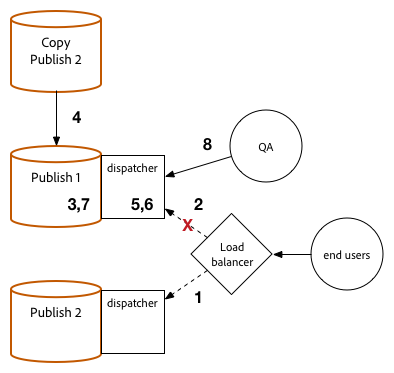

# 업그레이드 프로시저 {#upgrade-procedure}

>[!NOTE]
>
>업그레이드는 대부분의 Adobe Experience Manager(AEM) 업그레이드가 제대로 수행되므로 작성자 계층에 대한 다운타임이 필요합니다. 이러한 모범 사례를 따르면 게시 계층 다운타임을 최소화하거나 제거할 수 있습니다.

AEM 환경을 업그레이드할 때 작성자와 최종 사용자 모두의 가동 중지 시간을 최소화하기 위해 작성자 환경 또는 게시 환경 업그레이드 접근 방식의 차이점을 고려해야 합니다. 이 페이지에서는 현재 AEM 6.x 버전에서 실행 중인 AEM 토폴로지를 업그레이드하는 높은 수준의 절차에 대해 설명합니다. 작성 계층과 게시 계층, Mongo 및 TarMK 기반 배포 프로세스가 서로 다르기 때문에 각 계층과 마이크로커널은 별도의 섹션에 나열되어 있습니다. 배포를 실행할 때 Adobe에서는 먼저 작성자 환경을 업그레이드하고 성공을 결정한 다음 게시 환경으로 진행할 것을 권장합니다.

<!--
>[!IMPORTANT]
>
>The downtime during the upgrade can be significally reduced by indexing the repository before performing the upgrade. For more information, see [Using Offline Reindexing To Reduce Downtime During an Upgrade](/help/sites-deploying/upgrade-offline-reindexing.md)
-->

## TarMK 작성자 계층 {#tarmk-author-tier}

### 토폴로지 시작 중 {#starting-topology}

이 섹션의 가정된 토폴로지는 콜드 대기가 있는 TarMK에서 실행 중인 작성자 서버로 구성됩니다. 작성자 서버에서 TarMK 게시 팜으로 복제가 발생합니다. 여기에 표시되지 않지만 이 접근 방식은 오프로딩을 사용하는 배포에 사용할 수도 있습니다. 작성자 인스턴스에서 복제 에이전트를 비활성화한 후 다시 활성화하기 전에 새 버전에서 오프로딩 인스턴스를 업그레이드하거나 다시 빌드해야 합니다.

### 업그레이드 준비 {#upgrade-preparation}

1. 콘텐츠 작성을 중지합니다.

1. 대기 인스턴스를 중지합니다.

1. 작성자의 복제 에이전트를 비활성화합니다.

1. [업그레이드 전 유지 관리 작업](/help/sites-deploying/pre-upgrade-maintenance-tasks.md)을 실행하십시오.

### 업그레이드 실행 {#upgrade-execution}

1. [바로 업그레이드](/help/sites-deploying/in-place-upgrade.md)를 실행하십시오.
1. 필요한 경우 *Dispatcher 모듈을 업데이트합니다*.

1. QA가 업그레이드를 확인합니다.

1. 작성자 인스턴스를 종료합니다.

### 성공하면 {#if-successful}

1. 업그레이드된 인스턴스를 복사하여 콜드 대기를 생성합니다.

1. 작성자 인스턴스를 시작합니다.

1. 대기 인스턴스를 시작합니다.

### 실패한 경우(롤백) {#if-unsuccessful-rollback}

1. 콜드 대기 인스턴스를 새 기본 인스턴스로 시작합니다.

1. 콜드 대기 모드에서 작성자 환경을 다시 빌드합니다.

## MongoMK 작성자 클러스터 {#mongomk-author-cluster}

### 토폴로지 시작 중 {#starting-topology-1}

이 섹션의 가정된 토폴로지는 두 개 이상의 MongoMK 데이터베이스가 지원하는 두 개 이상의 AEM Author 인스턴스가 있는 MongoMK Author 클러스터로 구성됩니다. 모든 작성자 인스턴스는 데이터 저장소를 공유합니다. 이 단계는 S3 및 파일 데이터 저장소 모두에 적용되어야 합니다. 작성자 서버에서 TarMK 게시 팜으로 복제가 수행됩니다.

### 업그레이드 준비 {#upgrade-preparation-1}

1. 콘텐츠 작성을 중지합니다.
1. 백업을 위해 데이터 저장소를 복제합니다.
1. 기본 작성자인 AEM 작성자 인스턴스를 제외하고 모든 인스턴스를 중지합니다.
1. 주 Mongo 인스턴스인 복제본 세트에서 MongoDB 노드를 제외한 모든 노드를 제거합니다.
1. 단일 멤버 복제본 집합을 반영하도록 주 작성자의 `DocumentNodeStoreService.cfg` 파일을 업데이트하십시오.
1. 기본 작성자를 다시 시작하여 제대로 다시 시작되는지 확인합니다.
1. 기본 작성자의 복제 에이전트를 비활성화합니다.
1. 기본 작성자 인스턴스에서 [업그레이드 전 유지 관리 작업](/help/sites-deploying/pre-upgrade-maintenance-tasks.md)을 실행합니다.
1. 필요한 경우 기본 Mongo 인스턴스의 MongoDB를 WiredTiger가 있는 버전 3.2로 업그레이드합니다.

### 업그레이드 실행 {#Upgrade-execution-1}

1. 기본 작성자에서 [바로 업그레이드](/help/sites-deploying/in-place-upgrade.md)를 실행합니다.
1. 필요한 경우 Dispatcher 또는 웹 모듈 *을(를) 업데이트합니다*.
1. QA가 업그레이드를 확인합니다.

### 성공하면 {#if-successful-1}

1. 업그레이드된 Mongo 인스턴스에 연결된 새 6.5 작성자 인스턴스를 만듭니다.

1. 클러스터에서 제거된 MongoDB 노드를 다시 빌드합니다.

1. 전체 복제본 집합을 반영하도록 `DocumentNodeStoreService.cfg` 파일을 업데이트하십시오.

1. 작성자 인스턴스를 한 번에 하나씩 다시 시작합니다.

1. 복제된 데이터 저장소를 제거합니다.

### 실패한 경우(롤백)  {#if-unsuccessful-rollback-2}

1. 보조 작성자 인스턴스를 다시 구성하여 복제된 데이터 저장소에 연결합니다.

1. 업그레이드된 작성자 기본 인스턴스를 종료합니다.

1. 업그레이드된 Mongo 기본 인스턴스를 종료합니다.

1. 두 번째 Mongo 인스턴스 중 하나를 새 기본 인스턴스로 사용하여 시작합니다.

1. 아직 업그레이드되지 않은 Mongo 인스턴스의 복제본 집합을 가리키도록 보조 작성자 인스턴스에서 `DocumentNodeStoreService.cfg` 파일을 구성합니다.

1. 보조 작성자 인스턴스를 시작합니다.

1. 업그레이드된 작성자 인스턴스, Mongo 노드 및 데이터 저장소를 정리합니다.

## TarMK 게시 팜 {#tarmk-publish-farm}

### TarMK 게시 팜 {#tarmk-publish-farm-1}

이 섹션의 가정된 토폴로지는 두 개의 TarMK 게시 인스턴스로 구성되며, 앞에는 로드 밸런서가 있습니다. 작성자 서버에서 TarMK 게시 팜으로 복제가 발생합니다.

### 업그레이드 실행 {#upgrade-execution-2}

1. 로드 밸런서에서 Publish 2 인스턴스에 대한 트래픽을 중지합니다.
1. 게시 2에서 [업그레이드 전 유지 관리](/help/sites-deploying/pre-upgrade-maintenance-tasks.md)를 실행하십시오.
1. 게시 2에서 [바로 업그레이드](/help/sites-deploying/in-place-upgrade.md)를 실행하십시오.
1. 필요한 경우 Dispatcher 또는 웹 모듈 *을(를) 업데이트합니다*.
1. Dispatcher 캐시를 플러시합니다.
1. QA는 방화벽 뒤의 Dispatcher을 통해 게시 2의 유효성을 검사합니다.
1. 게시 2 종료.
1. Publish 2 인스턴스를 복사합니다.
1. 게시 시작 2.

### 성공하면 {#if-successful-2}

1. 게시 트래픽에 활성화 2.
1. 게시 1에 대한 트래픽을 중지합니다.
1. Publish 1 인스턴스를 중지합니다.
1. Publish 1 인스턴스를 Publish 2의 사본으로 바꿉니다.
1. 필요한 경우 Dispatcher 또는 웹 모듈 *을(를) 업데이트합니다*.
1. 게시 1에 대한 Dispatcher 캐시를 플러시합니다.
1. 게시 시작 1.
1. QA는 Dispatcher을 통해, 방화벽 뒤에 있는 게시 1을 확인합니다.

### 실패한 경우(롤백) {#if-unsuccessful-rollback-1}

1. Publish 1의 복사본을 만듭니다.
1. Publish 2 인스턴스를 Publish 1의 사본으로 바꿉니다.
1. 게시 2에 대한 Dispatcher 캐시를 플러시합니다.
1. 게시 시작 2.
1. QA는 방화벽 뒤의 Dispatcher을 통해 게시 2의 유효성을 검사합니다.
1. 게시 트래픽에 활성화 2.

## 최종 업그레이드 단계 {#final-upgrade-steps}

1. 게시 트래픽에 활성화 1.
1. QA는 공개 URL에서 최종 유효성 검사를 수행합니다.
1. 작성자 환경에서 복제 에이전트를 활성화합니다.
1. 콘텐츠 작성을 재개합니다.
1. [업그레이드 후 확인](/help/sites-deploying/post-upgrade-checks-and-troubleshooting.md)을 수행합니다.

