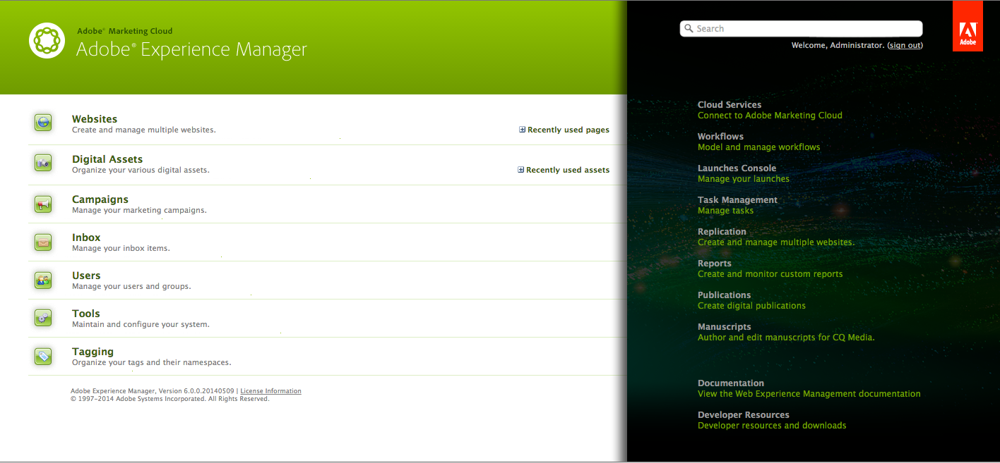

# 시작 콘솔 사용자 지정(클래식 UI){#customizing-the-welcome-console-classic-ui}

>[!CAUTION]
>
>이 페이지는 클래식 UI를 다룹니다.
>
>표준 터치 사용 UI에 대한 자세한 내용은 [콘솔 사용자 지정](/help/sites-developing/customizing-consoles-touch.md)을 참조하십시오.

시작 콘솔은 AEM 내의 다양한 콘솔 및 기능에 대한 링크 목록을 제공합니다.

표시되는 링크를 구성할 수 있습니다. 특정 사용자 및/또는 그룹에 대해 정의할 수 있습니다. 수행할 작업은 대상 유형(대상 유형이 있는 콘솔의 섹션과 상관 관계가 있음)에 따라 다릅니다.

* [주 콘솔](#links-in-main-console-left-pane) - 주 콘솔의 링크(왼쪽 창)
* [리소스, 설명서 및 참조, 기능](#links-in-sidebar-right-pane) - 사이드바의 링크(오른쪽 창)

## 메인 콘솔의 링크(왼쪽 창) {#links-in-main-console-left-pane}

AEM의 기본 콘솔이 나열됩니다.

### 기본 콘솔 링크 표시 여부 구성 {#configuring-whether-main-console-links-are-visible}

노드 수준 권한은 링크를 볼 수 있는지 여부를 결정합니다. 해당 노드는 다음과 같습니다.

* **웹 사이트:** `/libs/wcm/core/content/siteadmin`

* **디지털 Assets:** `/libs/wcm/core/content/damadmin`

* **커뮤니티:** `/libs/collab/core/content/admin`

* **캠페인:** `/libs/mcm/content/admin`

* **받은 편지함:** `/libs/cq/workflow/content/inbox`

* **사용자:** `/libs/cq/security/content/admin`

* **도구:** `/libs/wcm/core/content/misc`

* **태그 지정:** `/libs/cq/tagging/content/tagadmin`

예:

* **도구**&#x200B;에 대한 액세스를 제한하려면 다음에서 읽기 액세스를 제거하십시오.

  `/libs/wcm/core/content/misc`

원하는 사용 권한을 설정하는 방법에 대한 자세한 내용은 [보안 섹션](/help/sites-administering/security.md)을 참조하세요.

### 사이드바의 링크(오른쪽 창) {#links-in-sidebar-right-pane}

이러한 링크는 다음 경로에 있는 노드에 대한 *및* 읽기 액세스 권한을 기반으로 합니다.

`/libs/cq/core/content/welcome`

기본적으로 제공되는 세 개의 섹션(약간 간격)이 있습니다.

<table>
 <tbody>
  <tr>
   <td><strong>리소스</strong></td>
   <td> </td>
  </tr>
  <tr>
   <td> 클라우드 서비스</td>
   <td><code>/libs/cq/core/content/welcome/resources/cloudservices</code></td>
  </tr>
  <tr>
   <td> 워크플로</td>
   <td><code>/libs/cq/core/content/welcome/resources/workflows</code></td>
  </tr>
  <tr>
   <td> 작업 관리</td>
   <td><code>/libs/cq/core/content/welcome/resources/taskmanager</code></td>
  </tr>
  <tr>
   <td> 복제</td>
   <td><code>/libs/cq/core/content/welcome/resources/replication</code></td>
  </tr>
  <tr>
   <td> 보고서</td>
   <td><code>/libs/cq/core/content/welcome/resources/reports</code></td>
  </tr>
  <tr>
   <td> 발행물</td>
   <td><code>/libs/cq/core/content/welcome/resources/publishingadmin</code></td>
  </tr>
  <tr>
   <td> 원고</td>
   <td><code>/libs/cq/core/content/welcome/resources/manuscriptsadmin</code></td>
  </tr>
  <tr>
   <td><strong>설명서 및 참조</strong></td>
   <td> </td>
  </tr>
  <tr>
   <td> 설명서</td>
   <td><code>/libs/cq/core/content/welcome/docs/docs</code></td>
  </tr>
  <tr>
   <td> 개발자 리소스</td>
   <td><code>/libs/cq/core/content/welcome/docs/dev</code></td>
  </tr>
  <tr>
   <td><strong>기능</strong></td>
   <td> </td>
  </tr>
  <tr>
   <td> CRXDE Lite</td>
   <td><code>/libs/cq/core/content/welcome/features/crxde</code></td>
  </tr>
  <tr>
   <td> 패키지</td>
   <td><code>/libs/cq/core/content/welcome/features/packages</code></td>
  </tr>
  <tr>
   <td> 패키지 공유</td>
   <td><code>/libs/cq/core/content/welcome/features/share</code></td>
  </tr>
  <tr>
   <td> 클러스터링</td>
   <td><code>/libs/cq/core/content/welcome/features/cluster</code></td>
  </tr>
  <tr>
   <td> 백업</td>
   <td><code>/libs/cq/core/content/welcome/features/backup</code></td>
  </tr>
  <tr>
   <td> 웹 콘솔  </td>
   <td><code>/libs/cq/core/content/welcome/features/config</code></td>
  </tr>
  <tr>
   <td> 웹 콘솔 상태 덤프  </td>
   <td><code>/libs/cq/core/content/welcome/features/statusdump</code></td>
  </tr>
 </tbody>
</table>

#### 사이드바 링크 표시 여부 구성 {#configuring-whether-sidebar-links-are-visible}

링크를 나타내는 노드에 대한 읽기 액세스를 제거하여 특정 사용자 또는 그룹에서 링크를 숨길 수 있습니다.

* 리소스 - 다음에 대한 액세스 제거:

  `/libs/cq/core/content/welcome/resources/<link-target>`

* 문서 - 다음에 대한 액세스 제거:

  `/libs/cq/core/content/welcome/docs/<link-target>`

* 기능 - 다음에 대한 액세스 제거:

  `/libs/cq/core/content/welcome/features/<link-target>`

예:

* **보고서**&#x200B;에 대한 링크를 제거하려면 다음에서 읽기 권한을 제거하십시오.

  `/libs/cq/core/content/welcome/resources/reports`

* **패키지**&#x200B;에 대한 링크를 제거하려면 다음에서 읽기 권한을 제거하십시오.

  `/libs/cq/core/content/welcome/features/packages`

원하는 사용 권한을 설정하는 방법에 대한 자세한 내용은 [보안 섹션](/help/sites-administering/security.md)을 참조하세요.

### 링크 선택 메커니즘 {#link-selection-mechanism}

`/libs/cq/core/components/welcome/welcome.jsp`에서는 속성이 있는 노드에서 쿼리를 실행하는 [ConsoleUtil](https://helpx.adobe.com/experience-manager/6-5/sites/developing/using/reference-materials/javadoc/com/day/cq/commons/ConsoleUtil.html)을 사용합니다.

* 값이 `cq:Console`인 `jcr:mixinTypes`

>[!NOTE]
>
>기존 목록을 보려면 다음 쿼리를 실행하십시오.
>
>* `select * from cq:Console`
>

사용자 또는 그룹에 mixin이 `cq:Console`인 노드에 대한 읽기 권한이 없는 경우 해당 노드가 `ConsoleUtil` 검색에 의해 검색되지 않으므로 콘솔에 나열되지 않습니다.

### 사용자 지정 항목 추가 {#adding-a-custom-item}

[링크 선택 메커니즘](#link-selection-mechanism)을 사용하여 링크 목록에 사용자 지정 항목을 추가할 수 있습니다.

위젯 또는 리소스에 `cq:Console` mixin을(를) 추가하여 목록에 사용자 지정 항목을 추가하십시오. 이 작업은 속성을 정의하여 수행합니다.

* 값이 `cq:Console`인 `jcr:mixinTypes`
