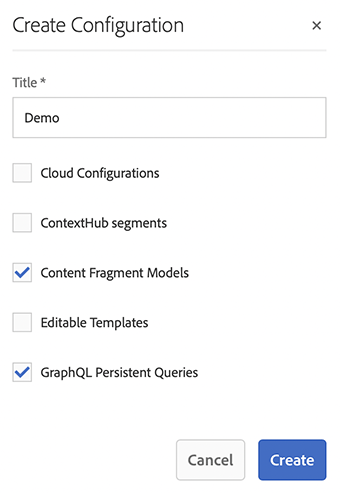

# 구성 Headless 빠른 시작 안내서 만들기 {#creating-configuration}

AEM 6.5에서 Headless를 시작하기 위한 첫 번째 단계로 구성을 만들어야 합니다.

## 구성이란? {#what-is-a-configuration}

구성 브라우저는 AEM의 구성에 대한 일반 구성 API, 콘텐츠 구조, 해결 메커니즘을 제공합니다.

AEM에서 Headless 콘텐츠 관리의 맥락에서 구성을 미래 콘텐츠 및 콘텐츠 조각의 구조를 정의하는 콘텐츠 모델을 만들 수 있는 AEM 내 작업 영역으로 생각하십시오. 이러한 모델들을 분리하기 위해 구성을 여러 개 가질 수 있습니다.

>[!NOTE]
>
>[전체 스택 AEM 구현의 페이지 템플릿](/help/sites-authoring/templates.md)에 익숙하다면 콘텐츠 모델 관리를 위한 구성 사용법도 유사합니다.

## 구성을 만드는 방법 {#how-to-create-a-configuration}

관리자는 구성을 한 번만 만들면 되며, 매우 드물게 콘텐츠 모델을 구성하기 위해 새 작업 영역이 필요한 경우에 만들어야 합니다. 이 시작 안내서에서는 구성을 하나만 만들면 됩니다.

1. AEM에 로그인하고 메인 메뉴에서 **도구 > 일반 > 구성 브라우저**&#x200B;를 선택합니다.
1. 구성에 대한 **제목**&#x200B;을 입력하십시오.
   * 제목을 기반으로 이름이 자동으로 생성되고 [AEM 명명 규칙](/help/sites-developing/naming-conventions.md)에 따라 조정됩니다. 저장소의 노드 이름이 됩니다.
1. 다음 옵션을 확인하십시오.
   * **콘텐츠 조각 모델**
   * **GraphQL 지속 쿼리**

   

1. **만들기**&#x200B;를 클릭합니다.

필요한 경우 여러 구성을 만들 수 있습니다. 구성은 중첩될 수도 있습니다.

>[!NOTE]
>
>구현 요구 사항에 따라 **콘텐츠 조각 모델** 및 **지속 쿼리** 외에 구성 옵션이 필요할 수 있습니다.

## 다음 단계 {#next-steps}

이제 시작 안내서의 두 번째 부분으로 이동하여 이 구성을 사용해서 [콘텐츠 조각 모델을 만들 수 있습니다.](create-content-model.md)

<!--
>[!TIP]
>
>For complete details about the Configuration Browser, [see the Configuration Browser documentation.](/help/sites-developing/configurations.md)
-->
