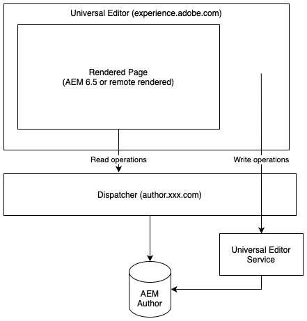

# 유니버설 편집기 정보 {#universal-editor}

유니버설 편집기의 유연성과 AEM 6.5 LTS를 사용하여 Headless 경험을 제공하는 데 어떻게 도움이 될 수 있는지에 대해 알아봅니다.

## 개요 {#overview}

범용 편집기는 Adobe Experience Manager Sites의 일부인 다용도 시각적 편집기입니다. 이를 통해 작성자는 Headless 경험에 대한 보이는 것(WYSIWYG) 편집을 수행할 수 있습니다.

* 작성자는 Universal Editor의 유연성을 활용할 수 있습니다. 모든 형태의 AEM Headless 콘텐츠에 대해 동일한 일관된 시각적 편집을 지원합니다.
* 개발자는 범용 편집기의 다목적성을 활용하여 구현을 완전히 분리할 수 있습니다. 따라서 개발자는 SDK 또는 기술의 제약 조건 없이 원하는 프레임워크나 아키텍처를 거의 사용할 수 있습니다.

자세한 내용은 [범용 편집기의 AEM as a Cloud Service 설명서](https://experienceleague.adobe.com/ko/docs/experience-manager-cloud-service/content/implementing/developing/universal-editor/introduction)를 참조하십시오.

## 아키텍처 {#architecture}

범용 편집기는 AEM과 함께 작동하면서 헤드리스 방식으로 콘텐츠를 작성하는 서비스입니다.

* 유니버설 편집기는 `https://experience.adobe.com/#/aem/editor/canvas`에서 호스팅되며 AEM 6.5 LTS에서 렌더링한 페이지를 편집할 수 있습니다.
* 범용 편집기는 AEM 작성자 인스턴스에서 Dispatcher을 통해 AEM 페이지를 읽습니다.
* Dispatcher와 동일한 호스트에서 실행되는 범용 편집기 서비스는 변경 사항을 AEM 작성자 인스턴스에 다시 기록합니다.



## 요구 사항 {#requirements}

다음은 범용 편집기를 지원합니다.

* AEM 6.5 LTS GA
   * 온-프레미스 및 Adobe Managed Services(AMS) 호스팅이 모두 지원됩니다.
* [AEM 6.5](https://experienceleague.adobe.com/ko/docs/experience-manager-65/content/implementing/developing/headless/universal-editor/introduction)
   * 온-프레미스 및 AMS 호스팅이 모두 지원됩니다.
* [AEM as a Cloud Service](https://experienceleague.adobe.com/ko/docs/experience-manager-cloud-service/content/implementing/developing/universal-editor/introduction)&#x200B;(릴리스 `2023.8.13099` 이상)

이 문서는 범용 편집기의 AEM 6.5 LTS 지원에 중점을 둡니다. AEM 6.5 LTS와 함께 범용 편집기를 사용하려면 다음이 필요합니다.

* AEM 6.5 LTS GA
* 올바르게 구성된 Dispatcher

## 설정 {#setup}

범용 편집기를 사용하려면 다음을 수행하십시오.

1. [AEM 작성 인스턴스에서 서비스를 구성합니다.](#configure-aem)
1. [로컬 범용 편집기 서비스를 설정합니다.](#set-up-ue)
1. [범용 편집기 서비스를 허용하도록 Dispatcher을 조정합니다.](#update-dispatcher)

설정을 완료하면 [범용 편집기를 사용하도록 애플리케이션을 계측](#instrumentation)할 수 있습니다.

### 서비스 구성 {#configure-aem}

범용 편집기는 구성해야 하는 여러 서비스를 사용합니다.

#### `login-token` 쿠키의 SameSite 속성을 설정합니다. {#samesite-attribute}

1. 구성 관리자를 엽니다.
   * `http://<host>:<port>/system/console/configMgr`
1. 목록에서 **Adobe Granite 토큰 인증 핸들러**&#x200B;를 찾고 **구성 값 변경**&#x200B;을 클릭합니다.
1. 대화 상자에서 **login-token 쿠키의 SameSite 속성**(`token.samesite.cookie.attr`) 값을 `Partitioned`로 변경합니다.
1. **저장**&#x200B;을 클릭합니다.

#### `SAMEORIGIN` 헤더 X-Frame option을 제거합니다. {#sameorigin}

1. 구성 관리자를 엽니다.
   * `http://<host>:<port>/system/console/configMgr`
1. 목록에서 **Apache Sling Main Servlet**&#x200B;을 찾고 **구성 값 편집**&#x200B;을 클릭합니다.
1. **추가 응답 헤더** 속성(`sling.additional.response.headers`)에서 `X-Frame-Options=SAMEORIGIN` 값이 있으면 삭제합니다.
1. **저장**&#x200B;을 클릭합니다.

#### Adobe Granite 쿼리 매개 변수 인증 핸들러 구성 {#query-parameter}

1. 구성 관리자를 엽니다.
   * `http://<host>:<port>/system/console/configMgr`
1. 목록에서 **Adobe Granite 쿼리 매개변수 인증 핸들러**&#x200B;를 찾고 **구성 값 편집**&#x200B;을 클릭합니다.
1. **경로** 필드(`path`)에서 `/`를 추가하여 활성화합니다.
   * 값이 비어 있으면 인증 핸들러가 비활성화됩니다.
1. **저장**&#x200B;을 클릭합니다.

#### 유니버설 편집기에서 열 콘텐츠 경로 또는 `sling:resourceTypes` 정의 {#paths}

1. 구성 관리자를 엽니다.
   * `http://<host>:<port>/system/console/configMgr`
1. 목록에서 **범용 편집기 URL 서비스**&#x200B;를 찾아 **구성 값 편집**&#x200B;을 클릭합니다.
1. 범용 편집기를 여는 콘텐츠 경로 또는 `sling:resourceTypes`를 정의합니다.
   * **범용 편집기 열기 매핑** 필드에서 범용 편집기를 여는 경로를 제공합니다.
   * 유니버설 편집기에서 열어야 하는 **Sling:resourceTypes 필드**&#x200B;에 유니버설 편집기에서 직접 여는 리소스 목록을 입력하십시오.
1. **저장**&#x200B;을 클릭합니다.
1. [외부화 구성](/help/sites-developing/externalizer.md)을 확인하고 최소한 다음 예제와 같이 로컬, 작성자 및 게시 환경이 설정되어 있는지 확인하십시오.

   ```text
   "local $[env:AEM_EXTERNALIZER_LOCAL;default=http://localhost:4502]",
   "author $[env:AEM_EXTERNALIZER_AUTHOR;default=http://localhost:4502]",
   "publish $[env:AEM_EXTERNALIZER_PUBLISH;default=http://localhost:4503]"
   ```

이러한 구성 단계가 완료되면 AEM이 페이지용 범용 편집기를 다음 순서로 엽니다.

1. AEM이 `Universal Editor Opening Mapping`에서 매핑을 확인하고 콘텐츠가 정의된 경로에 있는 경우 유니버설 편집기가 열립니다.

1. `Universal Editor Opening Mapping`에 정의된 경로 외부에 있는 콘텐츠의 경우 AEM은 `resourceType` 콘텐츠가 **Sling:resourceTypes의 유니버설 편집기에서 열어야 하는 항목과 일치하는지 확인합니다**. 일치하는 경우 AEM에서 `${author}${path}.html`에 있는 유니버설 편집기에서 콘텐츠를 엽니다.
1. 그렇지 않으면 AEM에서 페이지 편집기가 열립니다.

다음 변수는 `Universal Editor Opening Mapping`에서 매핑을 정의하는 데 사용할 수 있습니다.

* `path`: 열고자 하는 리소스의 콘텐츠 경로
* `localhost`: 스키마 없이 `localhost`에 대한 외부화 항목(예: `localhost:4502`)
* `author`: 스키마 없는 작성자에 대한 외부화 항목(예: `localhost:4502`)
* `publish`: 스키마 없이 게시하기 위한 외부화 항목(예: `localhost:4503`)
* `preview`: 스키마 없이 미리 보기하기 위한 외부화 항목(예: `localhost:4504`)
* `env`: 정의된 Sling 실행 모드에 기반한 `prod`, `stage`, `dev`
* `token`: `QueryTokenAuthenticationHandler`에 필요한 쿼리 토큰

매핑 예:

* AEM 작성자에서 `/content/foo` 아래의 모든 페이지를 엽니다.
   * `/content/foo:${author}${path}.html?login-token=${token}`
   * `https://localhost:4502/content/foo/x.html?login-token=<token>`을(를) 여는 중 결과
* 원격 NextJS 서버에서 `/content/bar` 아래의 모든 페이지를 열고 모든 변수를 정보로 제공합니다.
   * `/content/bar:nextjs.server${path}?env=${env}&author=https://${author}&publish=https://${publish}&login-token=${token}`
   * `https://nextjs.server/content/bar/x?env=prod&author=https://localhost:4502&publish=https://localhost:4503&login-token=<token>`을(를) 여는 중 결과

### 범용 편집기 서비스 설정 {#set-up-ue}

AEM을 업데이트하고 구성하면 로컬 개발 및 테스트를 위해 로컬 범용 편집기 서비스를 설정할 수 있습니다.

1. Node.js 버전 20 이상을 설치합니다.
1. [소프트웨어 배포](https://experienceleague.adobe.com/ko/docs/experience-cloud/software-distribution/home)에서 최신 유니버설 편집기 서비스를 다운로드하고 압축을 풉니다.
1. 환경 변수 또는 `.env` 파일을 사용하여 유니버설 편집기 서비스를 구성하십시오.
   * [자세한 내용은 범용 편집기의 AEM as a Cloud Service 설명서를 참조하십시오.](https://experienceleague.adobe.com/ko/docs/experience-manager-cloud-service/content/implementing/developing/universal-editor/local-dev#setting-up-service)
   * 내부 IP를 다시 작성해야 하는 경우 `UES_MAPPING` 옵션을 사용해야 할 수도 있습니다.
1. `universal-editor-service.cjs`를 실행합니다.

### Dispatcher 업데이트 {#update-dispatcher}

AEM이 구성되어 있고 로컬 유니버설 편집기 서비스가 실행 중인 경우 Dispatcher에서 새 서비스 [에 대한 역방향 프록시를 허용해야 합니다.](https://experienceleague.adobe.com/ko/docs/experience-manager-dispatcher/using/dispatcher)

1. 역방향 프록시를 포함하도록 작성자 인스턴스의 vhost 파일을 조정합니다.

   ```html
   <IfModule mod_proxy.c>
    ProxyPass "/universal-editor" "http://localhost:8080"
    ProxyPassReverse "/universal-editor" "http://localhost:8080"
   </IfModule>
   ```

   >[!NOTE]
   >
   >8080은 기본 포트입니다. [`.env` 파일](https://experienceleague.adobe.com/ko/docs/experience-manager-cloud-service/content/implementing/developing/universal-editor/local-dev#setting-up-service)의 `UES_PORT` 매개변수를 사용하여 해당 값을 변경하면 여기서 포트 값을 그에 따라 조정해야 합니다.

1. Apache를 다시 시작합니다.

## 앱 계기 {#instrumentation}

AEM이 업데이트되고 로컬 범용 편집기 서비스가 실행 중이면 범용 편집기를 사용하여 헤드리스 콘텐츠 편집을 시작할 수 있습니다.

그러나 범용 편집기를 사용하려면 앱을 계측해야 합니다. 여기에는 콘텐츠를 지속하는 방법과 위치를 편집자에게 지시하는 메타 태그가 포함됩니다. 이 계측에 대한 자세한 내용은 [AEM as a Cloud Service의 범용 편집기 설명서](https://experienceleague.adobe.com/ko/docs/experience-manager-cloud-service/content/implementing/developing/universal-editor/getting-started#instrument-page)에서 확인할 수 있습니다.

AEM as a Cloud Service이 포함된 범용 편집기에 대한 설명서를 참조할 때 AEM 6.5 LTS에서 사용할 때 다음 변경 사항이 적용됩니다.

* 메타 태그의 프로토콜은 `aem` 대신 `aem65`여야 합니다.

  ```html
  <meta name="urn:adobe:aue:system:aemconnection" content={`aem65:${getAuthorHost()}`}/>
  ```

* 범용 편집기 서비스 엔드포인트는 메타 태그를 통해 알려야 합니다.

  ```html
  <meta name="urn:adobe:aue:config:service" content={`${getAuthorHost()}/universal-editor`}/>
  ```

* 구성 요소 정의의 `plugins` 섹션에서 `aem` 대신 `aem65`를 사용해야 합니다.

>[!TIP]
>
>범용 편집기에 대한 포괄적인 개발자 안내서는 AEM as a Cloud Service 설명서에서 [AEM 개발자를 위한 범용 편집기 개요](https://experienceleague.adobe.com/ko/docs/experience-manager-cloud-service/content/implementing/developing/universal-editor/developer-overview)를 참조하십시오. 이 섹션에 설명된 AEM 6.5 LTS 변경 사항을 참고하십시오.

## AEM 6.5 LTS와 AEM as a Cloud Service의 차이점 {#differences}

AEM 6.5 LTS의 범용 편집기는 UI 및 대부분의 설정을 포함하여 AEM as a Cloud Service과 동일하게 작동합니다. 그러나 주의해야 할 차이점이 있습니다.

* 6.5 LTS의 유니버설 편집기는 Headless 사용 사례만 지원합니다.
* 범용 편집기의 설정은 6.5 LTS에 대해 약간 다릅니다([현재 문서의 ](#setup)에 설명).
* 6.5 LTS의 범용 편집기는 AEM as a Cloud Service과 다른 에셋 선택기와 콘텐츠 조각 선택기를 사용합니다.
