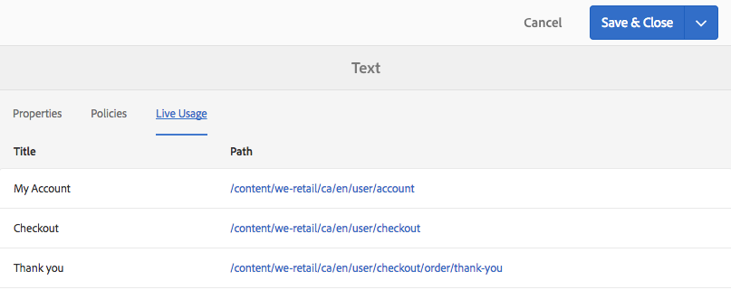

# We.Retail에서 핵심 구성 요소 시험 사용{#trying-out-core-components-in-we-retail}

핵심 구성 요소는 손쉽게 확장하고 프로젝트에 간단히 통합할 수 있는 현대적이고 유연한 구성 요소입니다. 핵심 구성 요소는 HTL, 즉시 사용 가능한 사용성, 구성 가능성, 버전 관리 및 확장성과 같은 몇 가지 주요 디자인 원칙을 기반으로 구축되었습니다. We.Retail은 핵심 구성 요소를 기반으로 합니다.

## 시험 사용 {#trying-it-out}

1. We.Retail 샘플 콘텐츠로 Adobe Experience Manager(AEM)를 시작하고 [구성 요소 콘솔](/help/sites-authoring/default-components-console.md)을 엽니다.

   **전역 탐색 > 도구 > 구성 요소**

1. 구성 요소 콘솔에서 레일을 열면 특정 구성 요소 그룹에 대해 필터링할 수 있습니다. 핵심 구성 요소는에서 찾을 수 있습니다.

   * `.core-wcm`: 표준 핵심 구성 요소
   * `.core-wcm-form`: 양식 제출 핵심 구성 요소

   `.core-wcm`을(를) 선택하십시오.

   

1. 모든 핵심 구성 요소의 이름이 **v1**&#x200B;로 지정됩니다. 이는 이 핵심 구성 요소의 첫 번째 버전임을 반영합니다. AEM과 호환되고 간편하게 업그레이드할 수 있어 최신 기능을 활용할 수 있는 일반 버전이 출시될 예정입니다.
1. **텍스트(v1)**&#x200B;을 클릭합니다.

   구성 요소의 **리소스 종류**&#x200B;이(가) `/apps/core/wcm/components/text/v1/text`인지 확인하세요. 핵심 구성 요소는 `/apps/core/wcm/components`에서 찾을 수 있으며 구성 요소별로 버전이 지정됩니다.

   

1. 구성 요소에 대한 개발자 설명서를 보려면 **설명서** 탭을 클릭하십시오.

   

1. 구성 요소 콘솔로 돌아갑니다. **We.Retail** 그룹을 필터링하고 **Text** 구성 요소를 선택합니다.
1. **리소스 종류**&#x200B;은(는) `/apps/weretail`에서 예상대로 구성 요소를 가리키지만 **리소스 우선 유형**&#x200B;은(는) 핵심 구성 요소 `/apps/core/wcm/components/text/v1/text`을(를) 다시 가리키는지 확인하십시오.

   

1. 이 구성 요소가 사용되는 페이지를 보려면 **라이브 사용량** 탭을 클릭하십시오. 페이지를 편집하려면 첫 **감사합니다** 페이지를 클릭하십시오.

   

1. 감사 페이지에서 텍스트 구성 요소를 선택하고 구성 요소의 편집 메뉴에서 상속 취소 아이콘을 클릭합니다.

   [We.Retail에는 전역 사이트 구조](/help/sites-developing/we-retail-globalized-site-structure.md)가 있습니다. 여기서 상속이라는 메커니즘을 통해 콘텐츠가 언어 마스터에서 [라이브 카피로 푸시됩니다](/help/sites-administering/msm.md). 따라서 사용자가 텍스트를 수동으로 편집할 수 있도록 하려면 상속을 취소해야 합니다.

   

1. **예**&#x200B;를 클릭하여 취소를 확인합니다.

   

1. 상속이 취소되고 텍스트 구성 요소를 선택하면 더 많은 옵션을 사용할 수 있습니다. **편집**&#x200B;을 클릭합니다.

   

1. 이제 텍스트 구성 요소에 사용할 수 있는 편집 옵션을 확인할 수 있습니다.

   

1. **페이지 정보** 메뉴에서 **템플릿 편집**&#x200B;을 선택합니다.
1. 페이지의 템플릿 편집기에서 페이지의 **레이아웃 컨테이너**&#x200B;에 있는 텍스트 구성 요소의 **정책** 아이콘을 클릭합니다.

   

1. 템플릿 작성자는 핵심 구성 요소를 통해 페이지 작성자가 사용할 수 있는 속성 을 구성할 수 있습니다. 이러한 기능에는 허용되는 붙여넣기 소스, 서식 옵션 및 사용 가능한 단락 스타일과 같은 기능이 포함됩니다.

   이러한 디자인 대화 상자는 많은 핵심 구성 요소에 사용할 수 있으며 템플릿 편집기와 함께 사용할 수 있습니다. 활성화되면 작성자는 구성 요소 편집기를 통해 사용할 수 있습니다.

   

## 추가 정보 {#further-information}

핵심 구성 요소에 대한 자세한 내용은 작성 문서 [핵심 구성 요소](https://experienceleague.adobe.com/docs/experience-manager-core-components/using/introduction.html)에서 핵심 구성 요소의 기능에 대한 개요를 참조하고 개발자 문서 [핵심 구성 요소 개발](https://experienceleague.adobe.com/docs/experience-manager-core-components/using/developing/overview.html)에서 기술 개요를 참조하십시오.

[편집 가능한 템플릿](/help/sites-developing/we-retail-editable-templates.md)을 추가로 조사할 수도 있습니다. 편집 가능한 템플릿에 대한 자세한 내용은 작성 문서 [페이지 템플릿 만들기](/help/sites-authoring/templates.md) 또는 개발자 문서 페이지 [템플릿 - 편집 가능](/help/sites-developing/page-templates-editable.md)을 참조하십시오.
